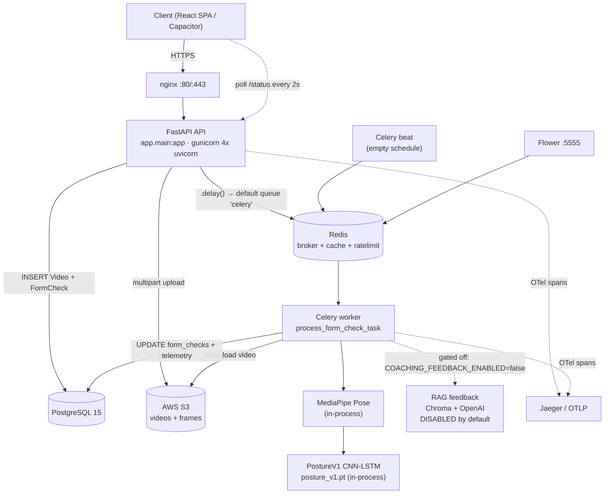

# FORMIQ — Repository Audit vs. CV Claims

**Audit date:** 2026-09-19
**Repo:** `/Users/tarpanmishra/formiq-app-3` @ `main` (`a4651fb`)
**Scope:** Read-only inventory. Nothing modified, created, or deleted except this file.

**Conventions used below**
- Every claim cites `path:line`. Where a thing does not exist, it is written **NOT FOUND** — never inferred from a name.
- "Live path" = the code that actually runs when a user submits a video today (`POST /api/v1/form-checks/submit`).
- Several subsystems exist in the repo but are **not wired into the live path**. Those are flagged explicitly, because an interviewer walking the code will find them.

---

## 1. Service map

### 1.1 Deployable units

| # | Name | Entrypoint | Responsibility | Calls | Called by | Deployed how |
|---|---|---|---|---|---|---|
| 1 | **API (`backend`)** | `backend/app/main.py` → `gunicorn ... uvicorn.workers.UvicornWorker app.main:app` (`backend/Dockerfile:74`) | FastAPI HTTP + WebSocket surface, auth, upload intake, task dispatch | PostgreSQL (asyncpg), Redis (cache/ratelimit), S3, Celery broker (enqueue only) | Browser/mobile client, nginx | `infrastructure/docker/docker-compose.yml:19-42`; `infrastructure/kubernetes/backend/deployment.yaml`; ECS via `.github/workflows/cd.yml:38-40` |
| 2 | **Celery worker** | `celery -A app.core.celery_app:celery_app worker` (`docker-compose.celery.yml:17-26`); also `backend/deployment/docker-compose.yml:36-40` with `-P gevent` | Runs `process_form_check_task`: pose extraction → PostureV1 inference → scoring → DB write | PostgreSQL (NullPool engine), S3, Redis (broker), PyTorch/MediaPipe in-proc | Redis broker (from API) | `docker-compose.celery.yml:17`. **No k8s manifest and no ECS service definition for the worker — NOT FOUND** |
| 3 | **Celery beat** | `celery -A app.core.celery_app:celery_app beat` (`docker-compose.celery.yml:49-53`) | Periodic scheduler | Redis | — | `docker-compose.celery.yml:49`. **`beat_schedule` is empty** (`backend/app/core/celery_app.py:76-82`) — this container currently schedules nothing |
| 4 | **Flower** | `celery ... flower --port=5555` (`docker-compose.celery.yml:66-72`) | Celery task UI | Redis | operator | `docker-compose.celery.yml:66` |
| 5 | **Frontend** | `frontend/Dockerfile`, served on `:80` | React/TS SPA (Capacitor for mobile) | API over HTTP | Browser | `infrastructure/docker/docker-compose.yml:4-17`; `frontend/vercel.json` |
| 6 | **PostgreSQL** | `postgres:15-alpine` | Primary datastore | — | API, worker | `infrastructure/docker/docker-compose.yml:44-53`; prod = `aws_db_instance.main` (`infrastructure/terraform/main.tf:80`) |
| 7 | **Redis** | `redis:7-alpine` | Celery broker + result backend, cache, rate-limit counters | — | API, worker, beat, flower | `infrastructure/docker/docker-compose.yml:55-60`; prod = `aws_elasticache_cluster.redis` (`infrastructure/terraform/main.tf:135`) |
| 8 | **nginx** | `nginx:1.25-alpine` | TLS termination, reverse proxy, static | API, frontend | Internet | `infrastructure/docker/docker-compose.prod.yml:41-56` |
| 9 | **Jaeger** | `jaegertracing/all-in-one:1.50` | Trace collector (dev only) | — | API, worker | `infrastructure/docker/docker-compose.yml:62-78` |
| 10 | **Prometheus + Alertmanager** | config only | Metrics scrape + alerting | API `/metrics` | — | `infrastructure/monitoring/prometheus/prometheus.yml`, `infrastructure/monitoring/alertmanager/alertmanager.yml`. **No container definition in any compose file — NOT FOUND** |

**Honest framing for "microservices":** this is **two deployable application processes** (API + Celery worker) sharing one database and one codebase, plus managed infrastructure. It is a *service-oriented async architecture*, not a microservice mesh. There is one shared `app/` package, one Postgres schema, and no inter-service HTTP calls. Calling it "microservices" in an interview is the single most likely place to get caught — see Gap G-01.

### 1.2 Diagram



---

## 2. The upload → result path

Traced from `POST /api/v1/form-checks/submit`. This is the path the product actually uses. (A second, older path exists at `POST /api/v1/videos/upload-url` → `process_video_celery_task`; see §2.2 — it is **not** the live path.)

| # | Step | File:line | Function | What it does | Sync/async |
|---|---|---|---|---|---|
| 1 | HTTP intake | `backend/app/api/v1/endpoints/form_checks.py:36-76` | `submit_form_check_for_analysis` | `POST /api/v1/form-checks/submit`, `multipart/form-data`, returns **202 Accepted** | sync (request-blocking) |
| 2 | Validation | `form_checks.py:82-104` | same | Validates `threshold_mode` ∈ {default,strict,safety}, `posture_v1_mode` ∈ {active,shadow}, and hard-gates `exercise_name` to a 5-item squat allowlist → else **400** | sync |
| 3 | Upload to storage | `backend/app/services/form_check_service.py:129-138` → `backend/app/services/storage_service.py:138` | `upload_file_and_get_key` | Writes to S3 under `form_check_videos/{user_id}/…`; returns the object key. **The whole file is uploaded inside the request** — the client waits for S3 before getting its 202 | sync within request |
| 4 | Exercise lookup | `form_check_service.py:141-167` | — | `SELECT … FROM exercise_templates WHERE LOWER(name)='squat'`; on miss, deletes the orphaned S3 object and raises 404 | async DB |
| 5 | Create `Video` row | `form_check_service.py:174-190` | — | `status=UPLOADED`, stores `object_key`, `exercise_type` | async DB |
| 6 | Create `FormCheck` row | `form_check_service.py:192-211` | `create_async` | `status=PENDING`, `video_url=s3://{bucket}/{key}`, links `video_id` | async DB |
| 7 | **Enqueue** | `form_check_service.py:224-229` | `process_form_check_task.delay(video_id_str, form_check_id_str)` | Broker = `settings.CELERY_BROKER_URL`, default `REDIS_URL` → `redis://localhost:6379/0` (`backend/app/core/config.py:401-404`). **Queue name = `celery` (the default)** — see §2.3 | fire-and-forget |
| 8 | Response | `form_checks.py:117` | — | 202 + FormCheck body with `status: "pending"` | — |
| 9 | Worker picks up | `backend/app/tasks/analysis_tasks.py:437-441` | `process_form_check_task` | Sync Celery task that wraps the async body in `asyncio.run(...)` | async inside |
| 10 | Idempotency guard | `analysis_tasks.py:486-488` | — | `if form_check.status != PENDING: return {"status":"skipped"}` | async |
| 11 | Mark PROCESSING | `analysis_tasks.py:490-492` | — | commits `status=PROCESSING` | async |
| 12 | Resolve video file | `analysis_tasks.py:155-233` | `_resolve_video_local_path` | Downloads from S3 to a temp file when `USE_S3_STORAGE=true` | async |
| 13 | **Decode + keypoints** | `analysis_tasks.py:235-283` | `_extract_pose_from_video` | `cv2.VideoCapture` loop, ≤ `AI_MAX_FRAMES_PER_VIDEO_ANALYSIS` (default 300) frames, `ai_svc.detect_pose(frame)` per frame, run in `asyncio.to_thread` | async wrapper over sync CV |
| 14 | Persist pose | `analysis_tasks.py:520-529` | — | Writes `video.raw_pose_data` / `pose_data` / `fps`, commits | async DB |
| 15 | Quality gates | `analysis_tasks.py:293-436` | `_check_body_landmark_visibility`, `_apply_duration_gate`, `_check_minimum_motion` | Visibility (landmarks 11,12,23,24,25,26,27,28 ≥0.3 vis on ≥50% frames), duration, motion floor → can force `decision="uncertain"` | sync helpers |
| 16 | Legacy temporal ML | `analysis_tasks.py:614-718` | `AIService.analyze_form_sequence` | Runs, but for squats its score is parked in `results.temporal_ml` and **must not** write `posture_score` (`analysis_tasks.py:656-672`) | async |
| 17 | **Model inference** | `analysis_tasks.py:736-845` → `backend/app/ml/posture_v1/loader.py:277` | `PostureV1TorchLoader.predict_posture` | 151-d features + 300×33×3 keypoints → CNN-LSTM → `prob_fault`; `decision` at threshold 0.525 | sync torch, inside async task |
| 18 | Scoring | `analysis_tasks.py:874-935` → `backend/app/ml/posture_v1/scoring.py:443` | `compute_full_scores` | posture_score, named component scores, calibrated confidence (temperature 1.5, `scoring.py:121`), level band | sync |
| 19 | Highlight frame | `analysis_tasks.py:955` | `select_highlight_frame` | Picks the frame to show the user | sync |
| 20 | Coaching feedback | `analysis_tasks.py:1071-1109` | `rag_feedback_service.generate_feedback` | **Gated off by default** (`COACHING_FEEDBACK_ENABLED` default `false`, `config.py:837-839`) | async, skipped |
| 21 | **Write result** | `analysis_tasks.py:1110-1118` | — | `form_check.results["posture_v1"] = payload`; `merge` | async DB |
| 22 | Telemetry row | `analysis_tasks.py:1124-1160` | `PostureV1InferenceLog` insert | decision, prob_fault, confidence, gate_flags, **`latency_ms`**, model_version | async DB, best-effort |
| 23 | DFAS (rules) | `analysis_tasks.py:1208-1247` | `analyze_form_dynamically` | **Skipped in practice** — requires `video.calculated_angles`, which nothing on this path populates (`analysis_tasks.py:1249-1255`) | async |
| 24 | Finalize | `analysis_tasks.py:1281-1292` | `finalize_form_check_analysis_async` (`form_check_service.py:271`) | Sets terminal status COMPLETED/FAILED + result payload, in a `finally:` block | async DB |
| 25 | **Client learns** | `frontend/src/pages/ModernProcessingPage.tsx:8,94` | `poll()` | **HTTP polling every 2000 ms** (`POLL_INTERVAL_MS = 2000`), backing off to 4000 ms on error; navigates to `/analysis/{id}` on completion | — |

### 2.1 Answers to the specific questions

- **Where the file is stored:** AWS S3, key `form_check_videos/{user_id}/{…}` (`form_check_service.py:131-136`). Local-disk fallback exists when `USE_S3_STORAGE=false`.
- **How the Celery task is enqueued:** `process_form_check_task.delay(...)` (`form_check_service.py:226`). **Broker:** Redis (`config.py:401`). **Queue name:** the Celery default `celery` — see §2.3.
- **What the worker does in order:** resolve/download → decode frames (OpenCV) → MediaPipe keypoints per frame → quality gates → 151-d feature extraction → CNN-LSTM inference → scoring → highlight frame → DB write → telemetry row → finalize.
- **How the client learns it's done:** **polling**, not push. A WebSocket stack exists (`backend/app/api/v1/endpoints/websockets.py:14`, `backend/app/services/feedback_service.py:31-103`) but `ConnectionManager.active_connections` is a **plain in-process dict** with no Redis pub/sub, so the separate Celery worker process cannot reach it. Grep of `app/tasks/` for `websocket|broadcast|notify` returns **zero hits**. The WebSocket path is therefore dead for analysis results.

### 2.2 A second, non-live pipeline exists

`app/tasks/video_tasks.py` and `app/tasks/ai_tasks.py` define a 3-stage chain (`process_video_celery_task` → `detect_pose_celery_task` → `calculate_angles_celery_task` → `perform_form_analysis_celery_task`). **All four are declared `async def` under a plain `@app.task` decorator** (`video_tasks.py:21-22`, `ai_tasks.py:35-36`, `ai_tasks.py:175-176`, `ai_tasks.py:340-342`). Celery's prefork pool does not await coroutines — calling these returns an un-awaited coroutine object. They are reachable from `videos.py:265` (`POST /videos/{id}/process`) and `analysis.py:51`. Treat this as legacy/dead code; do not present it as the working pipeline.

### 2.3 Queue-routing mismatch (real bug)

`docker-compose.celery.yml:26` starts the worker with `--queues=video_processing,pose_detection,form_analysis`. There is **no `task_routes` / `task_default_queue` anywhere** — grep for `task_routes|queue=|task_default_queue` across `app/` returns **0 hits**. `.delay()` therefore publishes to the default queue `celery`, which that worker does not consume. As configured, `docker-compose.celery.yml` would leave every task unprocessed. The worker in `backend/deployment/docker-compose.yml:40` has no `--queues` flag and *would* work.

---

## 3. Failure handling

Greps run over `backend/app/` excluding `__pycache__`:

| Term | Hits | Finding |
|---|---|---|
| `acks_late` / `task_acks_late` | **0** | **NOT FOUND** |
| `task_reject_on_worker_lost` | **0** | **NOT FOUND** |
| `visibility_timeout` | **0** | **NOT FOUND** |
| `dead_letter` / `dlq` | **0** | **NOT FOUND** |
| `idempot` | 3 | All in `training_session.py:14`, `lifespan.py:65`, `training_sessions.py:42` — **none on the video/form-check path** |
| `max_retries` | present | `analysis_tasks.py:437` declares `max_retries=3, default_retry_delay=300` |
| `self.retry(` | present | Only in the **dead** `video_tasks.py` / `ai_tasks.py` — **zero calls in `analysis_tasks.py`** |
| `time_limit` | present | `celery_app.py:51-52` |

### What actually happens

**If a worker dies mid-task:** the message is **lost**. `acks_late` defaults to `False`, so Celery acks the message the moment it is delivered, before the task body runs. There is no `task_reject_on_worker_lost`. The `FormCheck` row is left at `status=PROCESSING` **forever** — there is no reaper, no timeout sweeper, no beat job (`celery_app.py:76-82` beat schedule is empty). The frontend polls `ModernProcessingPage.tsx:94` indefinitely with no terminal condition for a stuck PROCESSING row.

**Can the same upload be processed twice?** Two different questions:
- *Same task delivered twice* (broker redelivery, manual re-dispatch): **guarded**. `analysis_tasks.py:486-488` returns early unless `status == PENDING`. This is a status-transition guard, not an idempotency key — it is read-then-write with no row lock, so two concurrent deliveries can both read `PENDING` and both proceed. Narrow race, but real.
- *Same video file uploaded twice by the user*: **completely unguarded**. Object keys are timestamp-based (`video_service.py:77`), there is no content hash, no checksum, no `Idempotency-Key` header. Two identical submissions produce two S3 objects, two `Video` rows, two `FormCheck` rows, two inference runs.

**Retry policy:** `max_retries=3, default_retry_delay=300` is declared on `process_form_check_task` but **is never exercised**. The task body catches `ValueError` and bare `Exception` (`analysis_tasks.py:1269-1279`), sets `final_status = FAILED`, and the `finally:` block finalizes and returns normally. The task never re-raises and never calls `self.retry()`. **Effective retry count on the live pipeline: 0.** This directly contradicts "fault-tolerant inference pipelines."

**Timeouts:**
- Celery: `task_soft_time_limit=180`, `task_time_limit=300` (`celery_app.py:51-52`). Global, not per-task. No handler catches `SoftTimeLimitExceeded`, so a slow video hits the soft limit → exception → caught by the generic `except Exception` → FAILED with no retry.
- Ingress: `proxy-read-timeout: 300` / `proxy-send-timeout: 300` (`infrastructure/kubernetes/backend/ingress.yaml:12-13`), `proxy-body-size: 50m` — **note this is below the 100 MB the API advertises** (`form_checks.py:60,67`).
- Circuit breakers (real, and good material): `backend/app/core/circuit_breaker.py` — OpenAI breaker `failure_threshold=3, recovery_timeout=120s, timeout=30s` (`rag_feedback_service.py:59-66`), vector store breaker `failure_threshold=5, recovery_timeout=60s` (`:69-75`), storage breaker `max_retries=2` (`storage_service.py:38`). These protect *outbound* calls and have fallbacks.

**Dead-letter handling:** **NOT FOUND.**

---

## 4. Data layer

### 4.1 Tables

17 tables, from `__tablename__` across `backend/app/models/`:

`users`, `user_sessions`, `user_settings`, `videos`, `form_checks`, `feedback_items`, `exercises`, `exercise_templates`, `exercise_configs`, `exercise_progress`, `progress_snapshots`, `workouts`, `workout_plans`, `squat_sessions`, `training_sessions`, `subscriptions`, `posture_v1_inference_logs`.

### 4.2 Migrations

Active linear chain, `backend/migrations/versions/`:

`0001_baseline` (down_revision `None`) → `0002_add_social_auth_fields` → `0003_add_profile_fields` → `0004_v1_stabilization` → `0005_add_user_profile_fields` → `0006_add_squat_sessions` → `0007_add_training_sessions` → `0008_seed_exercise_templates`.

### 4.3 Indexes — and the gap between docs and reality

**Indexes actually created by the active chain: 12 total.**

| Index | Migration:line |
|---|---|
| `ix_form_checks_user_id` | `0001_baseline.py:348` |
| `ix_form_checks_video_id` | `0001_baseline.py:349` |
| `ix_form_checks_status` | `0001_baseline.py:350` |
| `ix_form_checks_created_at` | `0001_baseline.py:351` |
| `ix_videos_user_id` | `0001_baseline.py:352` |
| `ix_videos_status` | `0001_baseline.py:353` |
| `ix_feedback_items_form_check_id` | `0001_baseline.py:354` |
| `ix_users_social_provider` | `0002_add_social_auth_fields.py:28` |
| `ix_users_social_id` | `0002_add_social_auth_fields.py:29` |
| `ix_form_checks_exercise_type` | `0004_v1_stabilization.py:51` |
| `ix_squat_sessions_user_id` | `0006_add_squat_sessions.py:37` |
| (training sessions index) | `0007_add_training_sessions.py:43` |

**`backend/migrations/versions/_archived/` contains 41 scripts with 127 further `create_index` calls**, including `_archived/2025_12_06_critical_performance_indexes.py` and `_archived/2025_12_06_supplementary_indexes.py`. `backend/docs/database_indexes.md` documents composite indexes (`ix_feedback_items_form_check_timestamp`, `ix_feedback_items_severity_type_timestamp`, etc.) that exist **only in `_archived/`** — verified: `active:0 archived:1` for each.

**~~Unverified risk~~ — RESOLVED 2026-09-19, this was NOT a defect.** I originally flagged that the 41 archived scripts might pollute the version graph and produce multiple heads, explicitly noting I could not run `alembic heads`. It has since been run (`bench/results/2026-09-19-day1.md` §1):

```
$ alembic heads --verbose   ->  Rev: 0008_seed_exercise_templates (head)   [exactly one]
$ alembic branches          ->  (no output)                                [zero branch points]
```

Alembic 1.13.1 only recurses into subdirectories of `versions/` when `recursive_version_locations` is set, and it is absent from `backend/alembic.ini`. `_archived/` is therefore invisible to alembic.

**This strengthens rather than weakens the other half of the finding:** the 127 `create_index` calls in `_archived/` are now *confirmed* to be unreachable, not merely suspected — alembic cannot see them at all. The active chain creates 12 indexes.

### 4.4 Connection pooling

`backend/app/core/database.py:99-126`. Two engines, deliberately different:

- **API engine** — `QueuePool` (`database.py:105`), `pool_size=20`, `max_overflow=30`, `pool_timeout=60`, `pool_recycle=1800`, `pool_pre_ping=True` (`database.py:113-119`; defaults at `config.py:337-352`). `NullPool` only for SQLite/tests.
- **Celery engine** — `_celery_async_engine` with `poolclass=NullPool` (`database.py:149-151`), with an in-code rationale at `database.py:140-149`: `asyncio.run()` per task destroys the event loop, so pooled asyncpg connections would be bound to a dead loop. This is a genuinely good, defensible design decision and worth being ready to explain.
- Celery concurrency is deliberately capped below the pool: `worker_concurrency=4` with the comment "capped well below DB pool_size (default 20)" (`celery_app.py:53-56`).
- Pool-usage monitoring: `backend/app/core/connection_pool.py:180-193`, warn at 80%, critical at 95%; started only in production/staging (`lifespan.py:106-109`).

### 4.5 Query optimization in history

`git log -S` for `ix_form_checks_user_id`, `critical_performance_indexes`, `idx_form_checks`, `25%`, `latency_reduction`: the index names appear only in migration-authoring and consolidation commits (`4148ce7`, `d0a3f42`). **No commit, script, or artifact contains a before/after query-timing measurement.** `backend/docs/database_indexes.md:94-104` is explicitly headed **"Before Indexes (Estimated Query Times)"** / **"After Critical Indexes (Estimated Query Times)"** — estimates, self-labelled.

---

## 5. Infra

### 5.1 Kubernetes

`infrastructure/kubernetes/backend/` — three files, backend only.

- **replicas: 3** (`deployment.yaml:7`); `RollingUpdate`, `maxSurge: 1`, `maxUnavailable: 0` (`deployment.yaml:11-15`).
- **HPA: NOT FOUND.** No `HorizontalPodAutoscaler` anywhere in `infrastructure/`. There is no k8s autoscaling target metric to quote.
- **Resources** (`deployment.yaml:45-51`): requests `cpu 500m / mem 512Mi`; limits `cpu 1000m / mem 1Gi`.
- **Probes** (`deployment.yaml:52-63`): liveness `GET /health` (initialDelay 30s, period 10s); readiness `GET /ready` (initialDelay 5s, period 5s).
  - ⚠️ Path mismatch: the app registers these under the health router prefix — `@router.get("/ready")` at `backend/app/api/v1/endpoints/health.py:356`, mounted at `/health` (`api.py:33`). The probe targets bare `/health` and `/ready` at the root. `GET /` exists (`main.py:135`) but `/ready` at root does **not** resolve to that handler. Readiness probes would likely 404 → pods never become Ready.
- **No k8s manifest for the Celery worker, Redis, or Postgres — NOT FOUND.**
- ⚠️ `.github/workflows/backend-cd.yml:44` runs `kubectl apply -f k8s/`, but **`./k8s/` does not exist** (manifests are at `infrastructure/kubernetes/`). This job cannot work as written.

### 5.2 Cloud providers

**AWS only.** Grep for `azure|azurerm|blob.core.windows` across the repo (excluding `node_modules`) returns exactly one file: `servers/README.md` — prose, no code. **There is no Azure infrastructure. Do not claim multi-cloud.**

AWS services actually declared in `infrastructure/terraform/`:

| Service | Resource | File:line |
|---|---|---|
| ECS (Fargate cluster) | `aws_ecs_cluster.main` | `main.tf:36` |
| ECR ×2 | `aws_ecr_repository.frontend/.backend` | `main.tf:51,65` |
| RDS PostgreSQL | `aws_db_instance.main` | `main.tf:80` |
| RDS read replica | `aws_db_instance.replica` (prod only) | `performance.tf:203` |
| ElastiCache Redis | `aws_elasticache_cluster.redis` + replication group | `main.tf:135`, `performance.tf:224` |
| S3 ×2 | `video_storage`, `frontend_assets` | `main.tf:204,214` |
| CloudFront | `aws_cloudfront_distribution.main` | `performance.tf:2` |
| ACM / Route53 | `aws_acm_certificate.main`, `aws_route53_record.main` | `performance.tf:164,242` |
| CloudWatch | log group, dashboard, 2 metric alarms | `monitoring.tf:2,13,76,98` |
| SNS | `aws_sns_topic.alerts` | `monitoring.tf:121` |
| X-Ray | `aws_xray_sampling_rule.main` | `monitoring.tf:131` |

**ECS autoscaling (this is the real autoscaling story, not k8s):** `infrastructure/terraform/performance.tf:179-201` — `min_capacity 2`, `max_capacity 4`, `TargetTrackingScaling` on **`ECSServiceAverageCPUUtilization`, `target_value = 70.0`**. So: **target metric = average CPU 70%, ceiling 4 tasks.** Note the ceiling — 4 tasks is your real scale story, and it bounds the "100+ concurrent" claim.

### 5.3 CI — 9 workflows, substantial overlap

| Workflow | Trigger | What it runs |
|---|---|---|
| `backend-tests.yml` (238 lines, the real one) | push `main`/`staging`, PR→`main`, paths `backend/**`; `workflow_dispatch` | **3 gates**: (1) `unit_api_tests` — `pytest -m "not integration and not e2e and not slow"`, every push/PR, no services (`:61-85`); (2) `integration_tests` — docker-compose Postgres:5434 + Redis:6380, `pytest -m integration`, conditional (`:87-97`); (3) `e2e_tests` — `pytest -m e2e`, dispatch or `staging` only (`:168-176`) |
| `ci.yml` | push/PR `main`,`develop` | frontend lint + test + build; backend tests |
| `test.yml` | push/PR `main`,`develop` | matrix py3.9/3.10 × node16/18 |
| `main.yml` | push/PR `main`,`dev` | frontend node16 lint/typecheck/test |
| `frontend-tests.yml` | paths `frontend/**` etc. | node20 lint, typecheck, test matrix |
| `backend-ci.yml` | push/PR `main` | py**3.8** + postgres13 + redis6 |
| `cd.yml` | push `main` | AWS creds → ECR build/push tagged `${{ github.sha }}` → `aws ecs update-service --force-new-deployment` staging, then production |
| `backend-cd.yml` | push `main` | **Broken**: `needs: test` references a job that does not exist in this file (`:10`, only job is `deploy`); applies nonexistent `k8s/` |
| `performance_testing.yml` | `workflow_dispatch` + weekly cron Mon 03:00 UTC | Locust run, default 100 users / 3m |

**What gates a merge:** cannot be determined from the repo — branch-protection rules live in GitHub settings, not in-tree. **NOT FOUND.** On file evidence, the intended PR gate is `backend-tests.yml` job 1 plus `ci.yml`/`test.yml`/`main.yml` frontend jobs. Python version is inconsistent across workflows (3.8 / 3.9 / 3.10 / 3.11), which undercuts "reproducible."

---

## 6. Auth, rate limiting, RBAC

### 6.1 Roles / RBAC

- **There is no role model.** The only authorization attribute is a boolean: `is_superuser = Column(Boolean, default=False, nullable=False)` (`backend/app/models/user.py:78`). No `UserRole` enum, no roles table, no permissions table. **A role-based access control system is NOT FOUND** — this is binary admin/not-admin.
- Dependencies (`backend/app/core/deps.py`): `get_current_user`, `get_current_active_user`, `get_current_active_superuser` (`:121-126`), `check_subscription_tier` (`:131-155`), `validate_form_check_access` (`:161-175`), `validate_feedback_access` (`:~199`). Re-exported via `backend/app/api/deps.py:3`.
- **Superuser enforcement is used on exactly one endpoint**: `backend/app/api/v1/endpoints/circuit_breakers.py:43`. `admin.py` does **not** use it.
- Ownership checks are the real authorization mechanism: `if form_check.user_id != current_user.id and not current_user.is_superuser: raise 403` (`deps.py:173-175`, repeated at `:199-201`).

**403 path in code** (`backend/app/core/deps.py:121-126`):
```python
def get_current_active_superuser(current_user: User = Depends(get_current_active_user)) -> User:
    if not current_user.is_superuser:
        raise HTTPException(
            status_code=status.HTTP_403_FORBIDDEN, detail="The user doesn't have enough privileges"
        )
```
15 `HTTP_403_FORBIDDEN` sites total across `app/` (deps ×4, auth ×4, csrf ×1, videos ×1, others).

### 6.2 Rate limiting — the strongest answer in this section

**Algorithm: weighted sliding-window counter**, backed by **Redis**, with an in-process fallback.

`backend/app/core/middleware/rate_limiter.py:208-251`:
```python
window_key = f"{key}:{now // window}"
await pipe.incr(window_key)
await pipe.expire(window_key, window * 2)
prev_window_key = f"{key}:{(now // window) - 1}"
...
window_position = (now % window) / window
weighted_count = int(prev_count * (1 - window_position) + curr_count)
```
Two fixed buckets (current + previous) interpolated by position in the window — the standard sliding-window-counter approximation. **Not a token bucket**, despite a `burst_size` parameter.

- **Backed by:** Redis (`main_setup.py:69-70` passes `cache_service.redis_client`). Falls back to `MemoryRateLimiter` (`rate_limiter.py:15-53`) on Redis error (`:251`).
- **Registration is conditional:** `if cache_service and hasattr(cache_service,'redis') and cache_service.is_available()` (`main_setup.py:58`). If Redis is down at boot, the `else` branch logs *"Redis unavailable … rate limiting disabled!"* (`main_setup.py:84`) and **the API runs with no rate limiting at all**.
- **Per-endpoint rules** (`main_setup.py:61-64`): `/api/v1/auth/login` → limit 5, burst 10, window 60; `/api/v1/auth/register` → limit 3, burst 5, window 60.
- **Excluded paths:** `/health`, `/metrics`, `/docs`, `/redoc`, `/openapi.json`, `/api/v1/auth/verify` (`config.py:682`).
- **429 path** (`rate_limiter.py:309-330`): returns `X-RateLimit-Limit`, `X-RateLimit-Remaining: "0"`, `X-RateLimit-Reset`, `Retry-After: reset - now`, then raises `RateLimitExceededException`. Successful responses also carry the three `X-RateLimit-*` headers (`:343-345`).
- **Separate** email rate limiter: `backend/app/core/rate_limit.py:43-90` — plain fixed-window `INCR` + `EXPIRE`, **fails open** on Redis error (`:62`, `:90`), 3/hour for verification and password reset (`:28-39`).

### 6.3 Auth mechanism

JWT (`backend/app/core/auth.py`, `token_utils.py`, `security.py`), social/OAuth (`social_auth_service.py`, migration `0002`), CSRF middleware (`backend/app/core/csrf.py:26`), plus TS-side config in `config/security/`.

---

## 7. Observability

### 7.1 OpenTelemetry

`backend/app/core/tracing.py` (246 lines).

- **Auto-instrumentations attempted** (`tracing.py:131-138`): FastAPI, SQLAlchemy, Redis, HTTPX, Requests, Logging. Plus **Celery**, instrumented separately at `backend/app/core/celery_app.py:7-21`. Each is `_safe_import`-guarded, so a missing package degrades silently to a warning (`tracing.py:153`).
- **Exporter** (`tracing.py:78-108`): OTLP if `OTEL_EXPORTER_OTLP_ENDPOINT` is set (default `None`, `config.py:891-893`), else Jaeger (`JAEGER_HOST` default `localhost:6831`, `config.py:883-889`), wrapped in `BatchSpanProcessor`.
- **Sampling:** `TraceIdRatioBasedSampler(settings.TRACE_SAMPLE_RATE)`, **default 0.1 = 10%** (`tracing.py:66-72`, `config.py:895-896`). `OTEL_ENABLED` defaults `true` (`config.py:875-877`).
- **Packages pinned:** `opentelemetry-api/sdk 1.21.0`, `exporter-otlp 1.21.0`, `exporter-jaeger 1.5.0`, instrumentation `0.42b0` for fastapi/sqlalchemy/redis/httpx/celery/logging (`backend/requirements.txt:47-57`).
- **⚠️ Manual spans: NOT FOUND.** Grep for `start_as_current_span|tracer\.` across `app/` returns exactly one hit — the definition of a no-op shim at `tracing.py:224`. **Zero business spans.** The entire AI pipeline — pose extraction, feature computation, model inference, scoring — is **unspanned**. You get an auto-span for the HTTP request and one for the Celery task, and nothing inside. Per-stage latency is not traceable.
- `TraceContextMiddleware` (`backend/app/core/middleware/trace_context.py`, added `main.py:118`) propagates `X-Correlation-ID`.

### 7.2 Prometheus

- **~35 metrics defined** in `backend/app/core/monitoring.py:20-226`: `http_requests_total`, `http_request_duration_seconds`, `db_query_duration_seconds`, `db_connections`, cache hit/miss/size, cpu/memory/disk, `form_checks_total`, `model_inference_duration` (`:101`), `model_confidence_scores` (`:108`), auth counters, `RATE_LIMIT_HITS` (`:149`), `VIDEO_PROCESSING_DURATION` (`:156`), `FRAME_PROCESSING_DURATION` (`:184`), `CONCURRENT_UPLOADS` (`:197`), `MODEL_INFERENCE_ERRORS` (`:212`). Six more in `monitoring_service.py:36-70`.
- **Defined ≠ emitted.** Call-site check outside `monitoring.py`:
  - `CONCURRENT_UPLOADS` — **imported at `video_processing_service.py:13` and never incremented. Zero emit sites.**
  - `VIDEO_PROCESSING_DURATION` — **zero call sites outside `monitoring.py`.**
  - `model_inference_duration` — **zero call sites outside `monitoring.py`.**
  - `FRAME_PROCESSING_DURATION` — observed once, `video_processing_service.py:348`. **But `VideoProcessingService` is not on the live path** — the live task calls `_extract_pose_from_video` (`analysis_tasks.py:235`) directly. So this metric is not emitted for real user traffic.
- **`setup_monitoring(app)` is never called.** It exists at `monitoring.py:303-319` (would call `Instrumentator().instrument(app).expose(app)` and register `GET /metrics`), but `main.py` does not call it; grep shows no caller. `lifespan.py:53` calls `init_monitoring()`, which is a different function.
- **`/metrics` endpoint:** the only live one is `backend/app/api/v1/endpoints/health.py:317-340`, i.e. **`/api/v1/health/metrics`**, returning rate-limit metrics via `HealthService`. Prometheus config scrapes it at `infrastructure/monitoring/prometheus/prometheus.yml`. There is **no root `/metrics`** exposing the default registry.
- **Net:** the metric catalogue looks impressive but the pipeline-performance metrics that back the CV numbers are inert.

### 7.3 Structured logging

`backend/app/core/logging.py`. **structlog → JSON** (`JSONRenderer` at `:50`, `dict_tracebacks` at `:49`, `format_exc_info` at `:45`). stdlib handlers use a `passthrough` formatter (`:83,93,99,107`); a human-readable `standard_dev` format is used when `environment == "development"` (`:86,93`). Sentry wired at `:162` (`sentry-sdk==1.40.0`, `requirements.txt:77`; `sentry-mcp.json` at repo root).

**Redaction: NOT FOUND.** No redaction/scrubbing processor in the structlog chain. Repo-wide grep for `redact|scrub|mask_|sanitize.*log|SENSITIVE_FIELDS` yields only `_mask_url()` for Redis connection strings (`backend/app/core/redis.py:15`). Nothing redacts tokens, passwords, emails, or PII from log records.

### 7.4 Dashboards and alerts

- **Prometheus alerts** (`infrastructure/monitoring/prometheus/rules/alerts.yml`): `HighErrorRate` (5xx ratio > 2% for 2m, critical), `HighLatency` (p95 > 500ms for 2m), `HighCPUUsage` (>85%/5m), `HighMemoryUsage` (>90%/5m), `HighDiskUsage` (>85%/5m), `ServiceDown` (`up == 0`).
- **Recording rules:** `infrastructure/monitoring/prometheus/recording_rules/success_rate.yml`.
- **Alertmanager:** `infrastructure/monitoring/alertmanager/alertmanager.yml`.
- **CloudWatch dashboard + alarms:** `infrastructure/terraform/monitoring.tf:13` (EC2/RDS/ElastiCache CPU + memory), alarms at `:76,98` → SNS `:121`.
- **Grafana dashboard JSON: NOT FOUND.**

### 7.5 The one genuinely strong observability asset

**ML inference telemetry.** `posture_v1_inference_logs` (`backend/app/models/telemetry.py:18-55`, created in `0001_baseline.py:323`) records per-inference: `decision`, `prob_fault`, `confidence`, `threshold`, `threshold_mode`, `posture_v1_mode`, `sequence_length`, `missing_ratio`, `outlier_z_gt3/6`, `angle_validity`, `gate_flags`, `top_signals`, `named_scores`, `model_version`, **`latency_ms`**, `error`. Written at `analysis_tasks.py:1124-1160`. Aggregation script: `backend/scripts/report_posture_v1_telemetry.py`. This is a real, defensible model-observability story — lead with it.

---

## 8. Tests

### 8.1 Counts

| Type | Files | Test functions | Collected by default? |
|---|---|---|---|
| `tests/unit/` | 53 | **785** | ✅ |
| `tests/api/` | 4 | **61** | ✅ |
| `tests/integration/` | 11 | **66** | ❌ excluded by `addopts -m "not integration…"` |
| `tests/e2e/` | 1 | **1** | ❌ excluded |
| `tests/analysis/` | 1 | 27 | ✅ |
| `tests/utils/` | 1 | 15 | ✅ |
| `tests/users/` | 1 | 12 | ✅ |
| `tests/legacy/` | 38 | **392** | ❌ **`norecursedirs`** (`backend/pytest.ini`) — never collected |
| **Total in tree** | | **1,359** | ~900 collected |

Config: `backend/pytest.ini` — `addopts = -m "not integration and not e2e and not slow" --asyncio-mode=auto --cov=app --cov-report=term-missing --cov-branch --no-cov-on-fail -q`, `timeout = 300`.

**Caveat on the headline number:** 392 of 1,359 (29%) are in `tests/legacy/` and are never run. Markers are also applied inconsistently — only 10 `@pytest.mark.unit`, 5 `@pytest.mark.api`, 33 `@pytest.mark.integration`, 2 `@pytest.mark.e2e` across a 1,359-test suite; directory location, not marker, does most of the selection work.

### 8.2 Async fixtures

`backend/tests/conftest.py` (root, 164 lines) has **no async fixtures** — `mock_db_session` (`:94`), `mock_settings` (`:128`), `video_processing_service` (`:146`), `mock_celery_task_module` (`:152`) are all sync `MagicMock`-based. Async fixtures live in the sub-conftests:

| Fixture | File:line | What it fakes / provides |
|---|---|---|
| `pg_engine` | `tests/e2e/conftest.py:76` | Real Postgres engine for e2e |
| `squat_template` | `tests/e2e/conftest.py:103` | Seeds the `Squat` `ExerciseTemplate` row |
| `e2e_user` | `tests/e2e/conftest.py:118` | Persisted authenticated user |
| `e2e_client` | `tests/e2e/conftest.py:171` | httpx client with auth + **`mock_storage`** (S3 faked) |
| `db_engine` | `tests/integration/conftest.py:53` | Integration DB engine |
| `test_async_session_factory` | `tests/integration/conftest.py:108` | Session factory |
| `db_session` | `tests/integration/conftest.py:115` | Per-test transactional `AsyncSession` |
| `pg_engine` / `squat_template` / `int_user` / `auth_client` / `anon_client` | `tests/integration/form_checks/conftest.py:53,83,98,121,172` | Form-check integration harness, authed + anonymous |
| `test_app` / `setup_database` / `db_session` / `client` / `test_user` | `tests/utils/conftest.py:227,312,387,393,404` | Full FastAPI app with DB overrides |
| `pending_upload_video` | `tests/integration/services/test_video_service.py:31` | `Video` row in pending-upload state |
| `video_for_pose_detection` / `video_for_angle_calculation` | `tests/integration/tasks/test_ai_tasks.py:27,59` | Video rows for the legacy AI tasks |
| `pipeline_test_video` | `tests/integration/pipeline/test_pipeline_segment_1_1_to_1_2.py:20` | Pipeline-segment fixture |

**S3 is mocked everywhere; MediaPipe and PyTorch are mocked in unit tests.** `tests/unit/test_posture_v1.py` does exercise the real `.pt` when present (`:880,1001`).

### 8.3 The e2e test stops before the pipeline

`backend/tests/e2e/test_full_flow.py:50` `test_full_video_to_form_check_flow` asserts: presigned URL 200 (`:72-79`), `object_key` persisted (`:94`), upload-complete 200 + `status == "processing"` (`:100-108`), submit **202** + `status == "pending"` (`:130-137`), and that the form check appears in history (`:150-154`).

**It never executes the Celery task, never runs inference, and never asserts a final score or COMPLETED status.** There is no end-to-end test of the analysis pipeline.

### 8.4 Load / benchmark scripts

| Script | Tracked? | Notes |
|---|---|---|
| `backend/perf/locustfile_video_uploads.py` (358 lines) | **UNTRACKED** (`git ls-files backend/perf` → empty) | The most realistic one: `VideoUploadUser` (`:25`) with login (`:39`), presigned-URL→S3→trigger flow (`:109-224`), `@task` weights 3/2/1 for 50KB/200KB/500KB (`:95-107`), `check_analysis_status` (`:226`), `AdminUser` (`:257`), `HighConcurrencyUser` (`:352`). **Uploads synthetic bytes (`create_mock_video_data`, `:237`), not real video — it cannot exercise decode or inference.** |
| `backend/tests/locustfile.py` | tracked | Generic CRUD on workouts/plans; not the video path |
| `frontend/tests/load/locustfile.py`, `run_load_tests.py`, `types/k6.d.ts` | tracked | Frontend load scaffolding; `k6.d.ts` is a type stub — **no k6 script exists** |
| `scripts/performance_test.sh` | tracked | Shell driver |
| `.github/workflows/performance_testing.yml` | tracked | Weekly cron, default 100 users / 3m |
| `backend/tests/legacy/test_performance.py`, `test_storage_performance.py`, `test_video_upload_performance.py` | tracked | **In `tests/legacy/` → never collected** |
| `backend/tests/performance/` | — | **NOT FOUND** — yet `backend/docs/FORMIQ_Performance_Results.md` tells the reader to run `pytest tests/performance/`. That command fails today. |

### 8.5 Skips

6 conditional skips, all defensible (`tests/analysis/test_ai_service.py:669`; `tests/unit/test_posture_v1.py:768,777,875,880,1001` — skip when fixture manifests or `posture_v1.pt` are absent). **No `xfail`, no flaky markers.**

### 8.6 ML evaluation scripts (real, and untracked)

`backend/scripts/`: `eval_posture_v1_fixtures.py`, `sweep_posture_v1_threshold.py`, `debug_posture_v1_distribution.py`, `e2e_posture_v1_smoke.py`, `smoke_posture_v1.py`, `validate_posture_v1_production.py`, `controlled_divergence_experiment.py`, `report_posture_v1_telemetry.py`. The **scripts are tracked**; their outputs in `backend/scripts/output/` are **NOT tracked** (see §9.8).

---

## 9. The AI feedback pipeline

### 9.1 Pose model

- **MediaPipe Pose**, `mediapipe==0.10.18` (`backend/requirements.txt:32`).
- Config (`backend/app/services/ai_service.py:81-86`): `static_image_mode=False`, `model_complexity=settings.AI_MODEL_COMPLEXITY` (**default 2 — the heavy model**, `config.py:768-770`), `min_detection_confidence=0.5`, `min_tracking_confidence=0.5` (`config.py:772-777`).
- Fallback path drops to `model_complexity=1` on init failure (`ai_service.py:100-104`); a GPU batch pose instance also uses complexity 1 (`ai_service.py:160-164`). The complexity actually used is tracked as `_pose_complexity_used` / `_pose_complexity_fallback` and logged (`analysis_tasks.py:275-278`).

> **⚠ ADDED 2026-09-19 — the configured complexity is silently ignored in every container.** MediaPipe bundles the complexity 0/1 models but *downloads* `pose_landmark_heavy.tflite` (complexity 2) on first use. `backend/Dockerfile:60` switches to non-root `appuser` while `site-packages` is root-owned, so the download fails and the fallback fires:
> ```
> MediaPipe Pose init failed at complexity=2 ([Errno 13] Permission denied:
>   '.../pose_landmark_heavy.tflite'), falling back to complexity=1
> ```
> This is deterministic and applies to **production**, which uses the same Dockerfile. Impact is not cosmetic: on `T6ad8Et3C5Q_good_rep_1.mp4`, `scripts/output/posture_v1_labels_and_results.csv` records complexity 2 → `prob_fault=0.0001, confidence=1.000`, whereas the container measured complexity 1 → **`prob_fault=0.4739, confidence=0.052`** against a `0.525` threshold. Same video, same weights, near coin-flip instead of a confident call. The eval report was produced outside this container at complexity 2, which is one concrete reason its numbers do not reproduce in the deployed pipeline. Evidence: `bench/results/2026-09-19-day1.md` §5a.
- **33 landmarks**, `(x, y, z, visibility)`. Lazy-imported via `_LazyModule` (`ai_service.py:24-52`) to keep worker boot fast.

### 9.2 Feature extraction — 151-d, and precisely specified

`backend/app/ml/posture_v1/features_151d.py`. Order is pinned by `feature_order_version: "truth_spec_151d_v1"` (`artifacts/posture_v1_manifest.json`).

| Indices | Features | Count |
|---|---|---|
| 0–32 | `joint{0..32}_x_mean` | 33 |
| 33–65 | `joint{0..32}_x_std` | 33 |
| 66–86 | `joint{0..6}_{x,y,z}_range` (7 joints × 3) | 21 |
| 87–146 | 4 angles × 15 stats — `left_knee`, `right_knee`, `trunk`, `left_hip` | 60 |
| 147–150 | `bottom_trunk_wobble`, `knee_asymmetry_mean`, `bottom_knee_asymmetry`, `trunk_forward_lean` | 4 |
| | **Total** | **151** |

- Angles: `_compute_key_angles` (`:203`), `_angle_at_vertex_2d` (`:255`) — 2-D vertex angles.
- **Windowing / phase segmentation:** `_segment_squat_phases` (`:282`) splits the rep so "bottom-of-squat" features (`bottom_trunk_wobble`, `bottom_knee_asymmetry`) are computed on the bottom phase only. The 15 per-angle stats come from `_angle_15_stats` (`:344`); derived features from `_derived_features` (`:423`).
- **Sequence policy:** `first_300_truncate_zero_pad_tail`; keypoints `[300, 33, 3]`; **visibility channel dropped** (`visibility_dropped: true`); **keypoints NOT normalized** (`keypoint_normalization: "none_raw_mediapipe_0_1"`). All from the manifest.
- **Feature normalization:** `StandardScaler` fit on train only (`_apply_scaler`, `:538`), artifact `posture_v1_scaler.joblib` (4,223 B), fit on 767 training videos.

> **⚠ ADDED 2026-09-19 — the scaler is unpickled across scikit-learn versions.** Running the pipeline emits:
> ```
> InconsistentVersionWarning: Trying to unpickle estimator StandardScaler from
> version 1.6.1 when using version 1.4.0. This might lead to breaking code or invalid results.
> ```
> `posture_v1_scaler.joblib` was fitted under scikit-learn **1.6.1**; `requirements.txt:35` pins **1.4.0**. This scaler standardises all 151 features before inference, so any behavioural difference lands directly on `prob_fault`. A second concrete candidate cause of the train/serve gap in §9.8. Evidence: `bench/results/2026-09-19-day1.md` §5b.
- Data-quality signals: `compute_angle_validity` (`:500`), `compute_outlier_counts` (`:521`).

### 9.3 Classifier(s) — **there are two, and only one is real**

#### (a) PostureV1 — PyTorch **CNN-LSTM**. This is the production model.

- **Architecture** (`backend/app/ml/posture_v1/model.py:30-146`), three stages:
  1. **Temporal CNN** (`cnn_1d`, `:68-82`): `[B, 99, 300]` → Conv1d(k=5,pad=2) → ReLU → BatchNorm1d → Dropout(0.4), channels `[32, 64]`.
  2. **LSTM** (`:85-92`): `input_size=64`, `hidden=96`, `num_layers=2`, unidirectional, `pack_padded_sequence` for variable-length sequences (`:132-137`).
  3. **Fusion MLP** (`:94-106`): `concat(lstm_hidden[96], rep_features[151]) → 247 → 256 → 128 → 2` logits, ReLU + BatchNorm + Dropout(0.4).
- **Weights:** `backend/app/ml/posture_v1/artifacts/posture_v1.pt` — **3,169,130 bytes, present in the repo**. Source checkpoint `best_cnn_lstm_binary_enhanced_cw_f0.5_0.736.pt`.
- **Loader:** `backend/app/ml/posture_v1/loader.py` — `PostureV1TorchLoader._load_model` (`:202`), with **S3 fallback download** (`_download_model_from_s3`, `:158`, key `POSTURE_V1_MODEL_S3_KEY`, default `models/posture_v1.pt`). Cached per worker process behind a double-checked lock (`analysis_tasks.py:90-107`).
- **Decision threshold:** **0.525** (manifest; `loader.py:125-126`), overridable by `POSTURE_V1_THRESHOLD` env (`:137-146`) or named modes `default|strict|safety` (`THRESHOLD_MODES`, `:42`; `set_threshold_mode`, `:476`). Env var takes priority over mode (`:485`).
- **Training metrics (manifest, from the training repo):** val F0.5 **0.736**; test precision **0.743**, recall **0.705**, F1 **0.724**, F0.5 **0.735**, on **162** test samples; 21 epochs. Split: train 809 / val 244 / test 244.
- **Training code and dataset: NOT FOUND in this repo.** `CLAUDE.md` states the model was developed in a separate Jupyter codebase on the Penn Action Dataset (videos 1659–1889); `backend/retrain_squat_model.py` exists at repo root but is not the CNN-LSTM trainer. **You cannot show an interviewer how this model was trained from this repository.**

#### (b) `ml_models/squat/*.joblib` — a **scikit-learn RandomForest demo**. Not on the live path.

- Artifacts: `binary_classification_model.joblib`, `squat_form_pipeline.joblib` (`Pipeline(StandardScaler, RandomForestClassifier)`), `feature_scaler.joblib` — classes confirmed by reading the pickle symbol table (`sklearn.ensemble._forest.RandomForestClassifier`, `sklearn.pipeline.Pipeline`, `sklearn.preprocessing._data.StandardScaler`).
- **`production_metadata.json` reads, verbatim:**
  ```json
  { "model_type": "RandomForest_demo", "feature_count": 23,
    "training_accuracy": 1.0, "samples_used": 18, "optimal_threshold": 0.5 }
  ```
  **18 training samples, 100% training accuracy, named `_demo`.** Loaded by `backend/app/services/ml_model_service.py:38,132,149,166`.
- **This must never be described as a production classifier.** It is in the repo under a directory called `ml_models/` and an interviewer who greps will find it in under a minute. Be ready to say: "that's a leftover demo stub; the shipped model is the CNN-LSTM in `app/ml/posture_v1/`."

**"XGBoost": NOT FOUND.** No XGBoost/LightGBM anywhere in the repo.

**So the correct one-line answer is:** *PyTorch CNN-LSTM (Conv1d ×2 → 2-layer LSTM → fusion MLP over 151 engineered features), binary good/fault, threshold 0.525.*

### 9.4 Retrieval

| Aspect | Finding |
|---|---|
| **Corpus** | `backend/data/biomechanical_knowledge/squat_form_tips.json` — **15 entries**, all `exercise_type: "squat"`; `fault_type` distribution: posture 7, stability 6, depth 2. Fields: `id, title, content, category, exercise_type, fault_type, keywords, severity, affected_joints`. Mean `content` length **300 characters**. **The file is UNTRACKED by git** (`git ls-files backend/data` → empty). |
| **Chunking** | **None.** One document per tip: `content = f"{tip['title']}: {tip['content']}"` (`backend/app/core/vectorstore.py:124`). 15 docs in, 15 docs out. |
| **Embedding model** | OpenAI `text-embedding-ada-002` (`config.py:869-871`), via `OpenAIEmbeddings` (`vectorstore.py:42-45`). |
| **Vector store** | **Chroma**, `PersistentClient` (`vectorstore.py:71-84`), collection `biomechanical_knowledge` (`:32`), path `VECTOR_STORE_PATH` default `data/vector_store` (`config.py:861-863`). **`backend/data/vector_store` does not exist on disk — the index has never been built here.** |
| **top-k** | `RAG_TOP_K_RESULTS`, **default 3** (`config.py:865-867`). |
| **Filters** | Metadata filter on `exercise_type` and optionally `fault_type` (`vectorstore.py:187-200`). The caller passes only `exercise_type` (`rag_feedback_service.py:131-135`). |
| **Query construction** | `_prepare_retrieval_query` (`rag_feedback_service.py:94-115`): concatenates `"{exercise_type} form"` + fault names (underscores → spaces) + score-triggered phrases (`"posture alignment torso"` if posture < 80, `"stability balance knee tracking"` if stability < 80, `"depth range of motion hip"` if depth < 80). Plain string concatenation, no embedding-side tuning. |

**Three independent reasons retrieval cannot run as shipped:**
1. `COACHING_FEEDBACK_ENABLED` defaults **`false`** (`config.py:837-839`), so `analysis_tasks.py:1075` never enters the block.
2. `initialize_vector_store()` / `load_biomechanical_knowledge()` are called **only** from the manual script `backend/scripts/initialize_vector_store.py:45,51` — never from `lifespan.py` or any request path. So `vector_store` is `None` in any fresh process → `is_available()` returns falsy (`vectorstore.py:211-218`) → `rag_feedback_service.is_available()` false (`rag_feedback_service.py:281-287`).
3. **A required package is not installed.** The file pins `langchain==0.1.20`, `chromadb==0.4.22`, `openai==1.12.0` (`requirements.txt:41-44`) but neither `langchain-openai` nor `langchain-community` is declared. `vectorstore.py:16-17` imports both at module top level — an unguarded `ImportError`. `rag_feedback_service.py:14-28` guards its own import and degrades to `ChatOpenAI = None`.

   **Corrected 2026-09-19 after running it in the built image** (`bench/results/2026-09-19-day1.md` §6): `langchain-community` *does* arrive transitively via `langchain 0.1.20` and imports fine. Only **`langchain_openai` is genuinely absent** — `ModuleNotFoundError: No module named 'langchain_openai'` — and it is the one that breaks `import app.core.vectorstore`. Fixed on `audit/g05-rag-deps` (`langchain-openai==0.1.5`, plus `langchain-community==0.0.38` pinned explicitly rather than left transitive); `openai` did not need to move.

### 9.5 LLM

- **Provider:** OpenAI via LangChain `ChatOpenAI` (`rag_feedback_service.py:84-89`).
- **Model:** `RAG_MODEL_NAME`, **default `gpt-3.5-turbo`** (`config.py:849-851`).
- **Temperature:** `RAG_TEMPERATURE`, **default 0.7** (`config.py:857-859`).
- **Max tokens:** `RAG_MAX_TOKENS`, **default 500** (`config.py:853-855`).
- **Output schema: NOT FOUND.** No Pydantic parser, no function/tool calling, no JSON mode. The return is `response.content.strip()` (`rag_feedback_service.py:231`) — **free-form prose**.

**Prompt templates, verbatim from `backend/app/services/rag_feedback_service.py:157-194`:**

System message (`:157-170`):
```
You are an expert biomechanics coach providing personalized exercise feedback. 

Your task is to analyze exercise performance data and provide constructive, actionable feedback based on biomechanical principles.

Guidelines:
1. Be encouraging and constructive, not critical
2. Focus on the most important issues first (safety, then performance)
3. Provide specific, actionable corrections
4. Reference biomechanical principles when relevant
5. Adapt language to user level: {context.user_level}
6. Keep feedback concise but informative (2-3 key points)

Exercise: {context.exercise_name}
User Level: {context.user_level}
```

Human message (`:181-194`):
```
Analyze this {context.exercise_type} performance and provide feedback:

PERFORMANCE SCORES:
{score_summary}

IDENTIFIED ISSUES:
{fault_summary}

RELEVANT BIOMECHANICAL GUIDANCE:
{retrieved_knowledge}

{f"ADDITIONAL CONTEXT: {context.additional_context}" if context.additional_context else ""}

Provide personalized feedback that addresses the key issues and helps improve form:
```

Two implementation defects in this function, both worth knowing before someone points them out:
- `rag_feedback_service.py:176` joins retrieved documents with the **literal two-character escape `"\\n\\n"`**, not a newline. Retrieved passages arrive in the prompt on one line separated by a literal `\n\n`.
- `rag_feedback_service.py:230` calls `self.llm(messages)` — the deprecated `__call__` form, and a **blocking sync call made inside `async def openai_call()`**, which stalls the event loop for the duration of the completion.

### 9.6 Guardrails

| Guardrail | Status |
|---|---|
| Feedback-vs-classifier agreement check | **NOT FOUND** |
| Length limit on output | **NOT FOUND** (only `max_tokens=500` at the API) |
| Banned phrases / profanity / safety filter | **NOT FOUND** |
| Structured-output validation | **NOT FOUND** |
| **LLM failure fallback** | ✅ **Present.** `_generate_fallback_feedback` (`rag_feedback_service.py:252-279`) — deterministic template keyed on average score bands (≥90/≥80/≥70/else) plus per-component sentences. Invoked from three places: service unavailable (`:213-215`), OpenAI breaker open (`:221-223`), unexpected exception (`:244-246`). |
| **Circuit breakers** | ✅ OpenAI: 3 failures → open, 120s recovery, 30s timeout, 2 retries, 2s initial backoff (`:59-66`). Vector store: 5 failures → open, 60s recovery, 10s timeout, 1 retry (`:69-75`). |
| **Non-fatal isolation** | ✅ The whole feedback block is wrapped so a failure cannot fail the analysis (`analysis_tasks.py:1108-1109`). |

**Classifier-side guardrails are genuinely strong** — this is where to steer the conversation:
- Quality gates force `decision="uncertain"` rather than guessing: visibility gate on 8 key landmarks (`analysis_tasks.py:293-339`), duration/cadence gate (`:340-389`), minimum-motion gate (`:390-436`), missing-frame-ratio gate (`loader.py:327-335`).
- **Confidence calibration:** temperature scaling with `T = 1.5` to soften overconfidence (`scoring.py:121-128`), plus `compute_calibrated_confidence` penalized by outlier count and sequence length (`scoring.py:130`, called `analysis_tasks.py:974-979`).
- **Score containment:** `_apply_component_ceiling` (`scoring.py:217`) stops component scores exceeding what the evidence supports.
- **Shadow mode:** `posture_v1_mode="shadow"` writes results to `results["posture_v1_shadow"]` and never touches `posture_score` (`analysis_tasks.py:772-775`, `:1113`) — a real, working safe-rollout mechanism.
- **Single-writer discipline:** for squats PostureV1 is the sole writer of `posture_score`; the legacy temporal model is explicitly diverted to `results.temporal_ml` (`analysis_tasks.py:656-672`).
- **Uncertain ⇒ NULL:** an uncertain decision stores `score = None` so the UI shows "—" rather than a fabricated number (`analysis_tasks.py:1267`).

### 9.7 Latency

- **Measured and persisted:** `predict_posture` brackets inference with `time.monotonic()` (`loader.py:289`, `:444`), returns `latency_ms` on every return path including early exits (`:303,318,335,384,413,434`), logs it (`:446-447`), the task logs it again (`analysis_tasks.py:836-844`), and it is written to `posture_v1_inference_logs.latency_ms` (`telemetry.py:52`, `analysis_tasks.py:1150`). **This is real per-inference latency instrumentation.**
- **Not measured anywhere:** per-frame pose-detection time on the live path. `_extract_pose_from_video` (`analysis_tasks.py:235-283`) has **no timing code** — it logs frame counts and fps only. The `FRAME_PROCESSING_DURATION` histogram is only observed in `VideoProcessingService` (`video_processing_service.py:348`), which the live path does not call.
- **End-to-end task duration:** **NOT FOUND** — no wall-clock timer around `process_form_check_task`.
- **Budgets/SLOs in code:** **NOT FOUND.** Targets exist only in prose (`docs/performance/load_testing.md:134-157`).

### 9.8 Evaluation — real, and the numbers are uncomfortable

**Scripts (tracked):** `backend/scripts/eval_posture_v1_fixtures.py`, `sweep_posture_v1_threshold.py`, `debug_posture_v1_distribution.py`, `e2e_posture_v1_smoke.py`, `validate_posture_v1_production.py`, `controlled_divergence_experiment.py`.

**Outputs (present on disk, UNTRACKED by git — `git ls-files backend/scripts/output` → empty):**

`backend/scripts/output/posture_v1_combined_report.json`, dated `2026-02-18`, threshold 0.525, complexity 2, `total_videos: 24`, `scorable_n: 18`, `excluded_messy: 4`:

```json
"metrics_with_corrected_labels": {
  "TP": 1, "FP": 1, "TN": 8, "FN": 8,
  "precision": 0.5, "recall": 0.111, "f1": 0.182, "accuracy": 0.5,
  "uncertain_rate": 0.111, "borderline_count": 3
},
"metrics_with_strict_penn_action_labels": {
  "TP": 1, "FP": 1, "TN": 5, "FN": 11,
  "precision": 0.5, "recall": 0.083, "f1": 0.143, "accuracy": 0.353
}
```

**Read that against the manifest's offline test F1 of 0.724.** On a held-out 24-video end-to-end run the same model scores **F1 0.182, recall 0.111** — it misses ~89% of faults. That is a train/serve gap of roughly 4× in F1, and it is documented in your own repo. The report is admirably honest: it includes `wrong_cases_analysis.false_positives` with per-video `diagnosis` fields (e.g. `"model_issue"` on `good_squat_01.mp4`, prob_fault 0.7367), and `quality_gates` listing which videos each gate caught.

Other artifacts: `posture_v1_threshold_sweep.json` (per-sample `prob_fault` + decision, plus a sweep from threshold 0.2), `posture_v1_fixture_eval.json`, `posture_v1_distribution_report.json`, `posture_v1_labels_and_results.csv`, `review_queue.json`, `e2e_batch_good.json` / `e2e_batch_fault.json`.

**For the RAG/LLM feedback layer specifically:**
- Retrieval eval (recall@k, query→expected-passage pairs): **NOT FOUND**
- Golden feedback outputs: **NOT FOUND**
- Any LLM scoring or human-review artifact: **NOT FOUND**

There is **zero evaluation of the feedback pipeline**. Given that the interviewer flagged "AI-powered feedback pipelines," this is the highest-risk gap in the audit.

---

## 10. Evidence for CV claims

| # | Claim | Verdict | Evidence / what's missing |
|---|---|---|---|
| 1 | **"Supported 100+ concurrent uploads"** | ❌ **NOT FOUND** | The only document is `backend/docs/FORMIQ_Performance_Results.md`, which **contradicts the claim in its own table**: "Concurrent Users \| 100+ simultaneous \| ✅ **50 tested**", and in §"Comparison to Original Claims": *"100+ concurrent uploads → 50 tested successfully → ⚠️ Partial."* Worse, the measurement it reports is **`Total Requests: 50`** against a **"Health endpoint simulation"** — 50 total requests to a health endpoint, not 50 concurrent video uploads. No raw output, no run log, and the `pytest tests/performance/` command it prescribes cannot run (`backend/tests/performance/` **NOT FOUND**). A capable locustfile exists (`backend/perf/locustfile_video_uploads.py`) but is **untracked**, uploads synthetic bytes rather than real video, and has **no recorded run**. Independently, ECS autoscaling caps at **4 tasks** (`performance.tf:180`) and `worker_concurrency=4` (`celery_app.py:56`). |
| 2 | **"sub-300ms frame processing"** | ❌ **NOT FOUND** | The doc's own method section reads: *"Processing Pattern: MediaPipe pose detection **simulation**; Range: 20-250ms per frame (realistic variation)"*. The reported 139.1 ms avg / 228.2 ms p95 are **drawn from a synthetic distribution, not measured from MediaPipe**. Grep for `139.1`/`228.2`/`Frames Processed` across the repo (excluding docs) returns **no generating script**. The live path (`analysis_tasks.py:235-283`) contains **no per-frame timing at all**, and `FRAME_PROCESSING_DURATION` is never observed on it. **This number cannot be reproduced and should not be defended.** |
| 3 | **"reduced query latency by 25%"** | ❌ **NOT FOUND** | No measurement anywhere. `backend/docs/database_indexes.md:94-104` is explicitly headed **"(Estimated Query Times)"** for both before and after. `git log -S` for the index names and for `25%` surfaces only authoring/consolidation commits, no timing data. Additionally, the indexes that doc describes live in `migrations/versions/_archived/` (127 `create_index` calls) and are **not in the active chain** (12 `create_index` calls) — so even the estimate describes indexes that are not applied. |
| 4 | **"99.9% API success rate under load"** | ❌ **NOT FOUND** | The "100.0%" figure in the doc comes from the same 50-request health-endpoint simulation as claim 1, on **SQLite** (doc: *"Database: SQLite for testing"*). `docs/performance/load_testing.md:53-56` is headed **"Expected Results"** — targets, not measurements. A Prometheus recording rule for success rate exists (`infrastructure/monitoring/prometheus/recording_rules/success_rate.yml`) and an alert at >2% error (`alerts.yml`), but **no scrape data, dashboard export, or run log is in the repo**. |
| 5 | **"fault-tolerant inference pipelines"** | ⚠️ **PARTIAL — and the weak half is the part named "pipeline"** | **Real:** circuit breakers with fallbacks (`circuit_breaker.py`; OpenAI 3-fail/120s, vector store 5-fail/60s, storage 2-retry), deterministic feedback fallback (`rag_feedback_service.py:252`), four quality gates forcing `uncertain` instead of guessing, shadow mode, confidence calibration, `NullPool` for Celery to survive per-task event loops, exception isolation so telemetry/feedback failures can't fail analysis, and a raw-SQL fallback that marks a FormCheck FAILED if service init dies (`analysis_tasks.py:1304-1320`). **Missing:** `acks_late` **0 hits** → a worker killed mid-task loses the message and strands the row at PROCESSING forever; `max_retries=3` is declared but **`self.retry()` is never called** in `analysis_tasks.py`, so the effective retry count is **0**; no DLQ; no stuck-row reaper; no `SoftTimeLimitExceeded` handler. |
| 6 | **"reproducible CI/CD"** | ⚠️ **PARTIAL** | **Real:** 9 workflows; `backend-tests.yml` implements a clean 3-gate model (unit/API always, integration behind docker-compose + label, e2e on dispatch/staging); `cd.yml` builds and pushes images tagged `${{ github.sha }}` (`:32-36`) then forces ECS redeploy; multi-stage Dockerfile with non-root user (`backend/Dockerfile:28-29,60`); 64 of ~70 requirement lines pinned with `==`. **Against:** `backend-cd.yml` is **broken** — `needs: test` names a job absent from the file (`:10`) and it applies `k8s/`, which **does not exist**; Python version differs per workflow (**3.8 / 3.9 / 3.10 / 3.11**); 4 workflows duplicate the same frontend job; 6 requirement lines unpinned; **no lockfile** (no `poetry.lock` / `requirements.lock` / hashes); Terraform has **no remote state backend** declared. Branch-protection (what actually gates a merge) is not in-tree — **NOT FOUND**. |
| 7 | **"reducing debugging time" (observability)** | ⚠️ **PARTIAL** | **Real and strong:** OTel auto-instrumentation across FastAPI/SQLAlchemy/Redis/HTTPX/Requests/Logging/**Celery**, OTLP or Jaeger exporter, 10% ratio sampling; structlog JSON with `dict_tracebacks`; Sentry; `X-Correlation-ID` propagation middleware; 6 Prometheus alert rules + Alertmanager + CloudWatch dashboard/alarms/SNS; and the standout — the **`posture_v1_inference_logs` table** capturing per-inference decision, probability, calibrated confidence, gate flags, top signals, model version and **`latency_ms`**, with an aggregation script. **Against:** **zero manual spans** — the whole AI pipeline is unspanned, so you cannot attribute latency to decode vs. keypoints vs. inference; `setup_monitoring(app)` is never called so there is **no root `/metrics`** exposing the default registry; `CONCURRENT_UPLOADS`, `VIDEO_PROCESSING_DURATION` and `model_inference_duration` have **zero emit sites**; `FRAME_PROCESSING_DURATION` is emitted only off the live path; **no log redaction**; **no Grafana dashboard JSON** in-tree. |

### Bottom line

Four of seven claims rest on a single document (`backend/docs/FORMIQ_Performance_Results.md`) whose numbers come from a **health-endpoint loop and a synthetic frame-time distribution**, on SQLite, which the document itself partially disclaims. None of the four are reproducible from this repo today. The three architectural claims are partially real with specific, nameable holes.

The genuinely strong, defensible assets that the CV **does not** currently claim: the CNN-LSTM architecture and its threshold/calibration/shadow-mode discipline, the four quality gates, the ML telemetry table, and the honest 24-video end-to-end evaluation. Those are better interview material than any of the seven numbers above.

---

## 11. Gap list — ranked by interview risk

Risk = P(it comes up) × damage if you cannot answer. Effort: **S** ≤ half a day · **M** 1–3 days · **L** > 3 days.

| # | Gap | Why an interviewer cares | Effort | Proposed fix |
|---|---|---|---|---|
| **G-01** | **"100+ concurrent uploads", "sub-300ms frame processing", "99.9% success rate", "25% query latency" are all unreproducible.** The source doc measures 50 health-endpoint requests and a *simulated* frame-time distribution on SQLite, and disclaims itself. | This is the first thing they'll ask you to walk through, and the doc actively contradicts the CV. If they open it, the credibility loss extends to everything else you said. | **M** | Run `backend/perf/locustfile_video_uploads.py` for real against Postgres+Redis+worker with real video files; write `bench/results/<date>-concurrency.md` with the exact command, container limits, and raw output. **Restate the CV with whatever number comes out.** |
| **G-02** ✅ **FIXED 2026-09-20** (`audit/phase1-worker-model` `6306473`) | **No retry actually happens.** `max_retries=3` is declared at `analysis_tasks.py:437` but `self.retry()` is never called; every exception is swallowed → FAILED. Effective retries: **0**. | "Fault-tolerant inference pipelines" is on your CV. Reading 40 lines of the task disproves it. | **S** | Done. Transient (OperationalError, InterfaceError, DisconnectionError, ConnectionError, TimeoutError, redis connection/timeout) → `self.retry()` with 2**n backoff capped at 300s; everything else → FAILED with the reason. Deliberately **not** OSError (`IOError("Cannot open video")` is an OSError and a corrupt video is permanent) and **not** SoftTimeLimitExceeded. Exhausted retries reclassify as permanent, or the last attempt would release the row to PENDING with nothing left to claim it. 21 unit tests. |
| **G-03** ✅ **FIXED 2026-09-20** (`audit/phase1-worker-model` `a7ef456` + `c093e16`) | **`acks_late` = 0 hits. Worker death loses the message and strands the row at `PROCESSING` forever** — no reaper, no DLQ, empty beat schedule. | Standard senior-level queue question: "what happens if the worker dies mid-task?" The honest answer today is "the work is lost and the user waits forever." | **M** | Done. `task_acks_late=True`, `task_reject_on_worker_lost=True`, limits 180/300 → 300/360. Plus `app/tasks/maintenance_tasks.py`, a beat task every 60s. It scans **PENDING as well as PROCESSING** — the original failure raised inside `asyncio.run()` before ever setting PROCESSING, so a PROCESSING-only reaper would have missed all 17. Keys on `COALESCE(updated_at, created_at)` because `updated_at` has `onupdate` but no `server_default`. 30-min threshold, asserted by a test to exceed `task_time_limit × (1 + max_retries) + backoff` = 1447s. Re-dispatch once, then FAILED. 20 unit tests. |
| **G-04** | **No evaluation of the feedback pipeline at all** — no retrieval eval, no golden outputs, no recall@k, no human review. | They explicitly flagged "AI-powered feedback pipelines." "How do you know the feedback is any good?" has no answer. | **M** | Build 20–30 `(query, expected_passage)` pairs over the 15-doc corpus → `bench/retrieval_eval.py` printing recall@1/3/5; plus 20 videos with known faults → assert the generated feedback names the fault; report the hit rate. |
| **G-05** | **The RAG/LLM path cannot execute as shipped** — `COACHING_FEEDBACK_ENABLED=false` by default; the vector store is never initialized outside a manual script; `langchain-openai` and `langchain-community` are **missing from `requirements.txt`** while `vectorstore.py:16-17` imports them at module top level. | If asked to demo the feedback pipeline, it will not run. The missing deps are a clean-install crash. | **S** | Add `langchain-openai` / `langchain-community` (pinned) to requirements; build the Chroma index in CI or at startup; document the env flags needed to turn it on. |
| **G-06** | **Two models in-tree, and the wrong one is named `production_metadata.json`**: `"model_type": "RandomForest_demo", "samples_used": 18, "training_accuracy": 1.0`. | Anyone grepping `ml_models/` finds an 18-sample RandomForest with 100% training accuracy labeled "production." That reads as a red flag unless you get ahead of it. | **S** | Delete or clearly quarantine `app/ml_models/squat/` (e.g. `_deprecated/`) with a README pointing at `app/ml/posture_v1/`. Have one sentence ready: "that's a leftover demo; production is the CNN-LSTM." |
| **G-07** | **Offline F1 0.724 vs. end-to-end F1 0.182 / recall 0.111** on the 24-video run, and those eval outputs are **untracked**. | If you quote 0.72 and they find `posture_v1_combined_report.json`, it looks like cherry-picking. Conversely, owning the gap is a genuinely impressive answer. | **S** | Track `backend/scripts/output/` in git; write a short `EVAL.md` stating both numbers, the train/serve gap, and your diagnosis (domain shift, gate behavior, label noise) — the report already contains that analysis. |
| **G-08** | **"Microservices" overstates it.** Two processes, one codebase, one schema, zero inter-service calls. | Direct claim on the profile; an architecture walkthrough exposes it in five minutes. | **S** | Reword to "async service-oriented backend: FastAPI API + Celery inference workers over Redis/Postgres/S3." Cheapest credibility win in the list. |
| **G-09** | **Zero manual OTel spans.** The entire AI pipeline is unspanned — you cannot attribute latency to decode vs. keypoints vs. inference. | Undercuts "reduced debugging time," and it's the natural follow-up to any latency question. | **S** | Wrap `_resolve_video_local_path`, `_extract_pose_from_video`, feature extraction, `predict_posture`, and `compute_full_scores` in `start_as_current_span`. Attach `form_check_id`. |
| **G-10** ✅ **FIXED 2026-09-20** (`audit/phase1-worker-model` `5415c3b`) | **No idempotency on upload.** No content hash, no `Idempotency-Key`; timestamped keys. The status guard at `analysis_tasks.py:486` is a read-then-write race. | Classic system-design follow-up to "what if the client retries?" | **M** | Done. Key `(user_id, sha256(bytes), model_version, spec_hash)`; migration `0009_content_hash_idempotency` adds the columns plus a **partial** unique index (`WHERE content_hash IS NOT NULL`) and `(status, updated_at)` for the reaper. Bytes are hashed **before** the upload consumes the stream, then rewound. FAILED rows are excluded so a transient failure is not cached forever. The PENDING→PROCESSING transition is a **conditional UPDATE + rowcount**, not `FOR UPDATE`: a row lock would be held for the whole multi-minute analysis on a NullPool connection, so a killed worker would strand it and the reaper would block behind it. 13 unit tests. |
| **G-11** | **Queue-routing mismatch.** `docker-compose.celery.yml:26` consumes `video_processing,pose_detection,form_analysis`; no `task_routes` exists, so `.delay()` publishes to `celery`. That worker processes nothing. | "Walk me through how a task reaches the worker" ends at a config that cannot work. | **S** | Either add `task_routes` mapping tasks to those queues, or drop the `--queues` flag. One-line fix, but only if you know it's there. |
| **G-12** | **Perf metrics defined but never emitted:** `CONCURRENT_UPLOADS`, `VIDEO_PROCESSING_DURATION`, `model_inference_duration` have zero emit sites; `FRAME_PROCESSING_DURATION` fires only off the live path; **`setup_monitoring(app)` is never called**, so there is no root `/metrics`. | "You said you measured p95 frame time — where does that metric come from?" It currently comes from nowhere. | **S** | Call `setup_monitoring(app)` in `main.py`; observe `FRAME_PROCESSING_DURATION` inside `_extract_pose_from_video` and `model_inference_duration` around `predict_posture`; inc/dec `CONCURRENT_UPLOADS` around the upload handler. |
| **G-13** ✅ **FIXED 2026-09-24** | **No end-to-end pipeline test.** `test_full_flow.py` stops at `status == "pending"`; the Celery task, inference, and final result are never asserted. | "How do you know the pipeline works?" — currently unit tests plus manual scripts. | **M** | Add an e2e test that runs the task eagerly (or against a live worker) with a real short video and asserts COMPLETED + a `results.posture_v1.decision`.  **2026-09-24:** `tests/e2e/test_live_pipeline.py` drives one corpus clip through the running stack (register → submit → poll → `/ml-analysis`) and then asserts the decision trail A1–A10 for that user against the compose DB; **2 passed live in 13.9 s**. The stale `integration/tasks/test_analysis_tasks.py` (patched names that no longer existed, asserted a function defined nowhere) is deleted.|
| **G-14** | **Migrations: 127 `create_index` calls sit in `_archived/` and are not applied**; `database_indexes.md` documents indexes that do not exist in the active chain. Plus an unverified multiple-heads risk (no `version_locations` filter, no `_archived` exclusion in `env.py`). | Undercuts the query-optimization claim and invites "so which indexes are actually on the table?" | **M** | Run `alembic heads` to confirm or clear the multi-head risk; move `_archived/` outside `versions/`; promote the indexes you actually want into a new numbered migration; then measure before/after with `EXPLAIN ANALYZE` (this also feeds G-01's 25% claim). |
| **G-15** | **k8s probes likely 404.** Manifest probes `/health` and `/ready` at the root; the app serves `/api/v1/health/*` (`health.py:356`). No HPA exists; no worker/Redis/Postgres manifests. Real autoscaling is ECS CPU@70%, max 4 tasks. | Any k8s question exposes the gap between the manifest and the app — and "HPA target metric" has no k8s answer. | **S** | Either add root `/health` + `/ready` routes or fix the probe paths; **talk about ECS target-tracking CPU@70% (min 2 / max 4) as your autoscaling story**, not k8s. |
| **G-16** | **No log redaction.** structlog has no scrubbing processor; only Redis URLs are masked (`redis.py:15`). | A security-minded interviewer asks what's in your logs. Tokens, emails, and PII currently flow through unredacted. | **S** | Add a structlog processor that redacts a keyword denylist (`password`, `token`, `authorization`, `secret`, `email`). |
| **G-17** | **CI/CD reproducibility holes:** `backend-cd.yml` broken (`needs: test` → nonexistent job; applies nonexistent `k8s/`); Python 3.8/3.9/3.10/3.11 across workflows; 4 duplicate frontend jobs; no lockfile; no Terraform remote state. | "Reproducible CI/CD" is a direct claim; a broken deploy workflow is easy to spot. | **M** | Delete `backend-cd.yml` and the duplicate frontend workflows; pin one Python version everywhere; add `requirements.lock` (pip-compile with hashes); declare an S3+DynamoDB Terraform backend. |
| **G-18** | **WebSocket result delivery is dead.** `ConnectionManager.active_connections` is an in-process dict with no Redis pub/sub; the worker has zero WebSocket references. Clients poll every 2 s. | You have WebSocket code that looks like push-based delivery and isn't. Better to describe polling accurately. | **M** | Either say "2-second polling" plainly, or back the connection manager with Redis pub/sub and publish from the task. |
| **G-19** ✅ **FIXED 2026-09-20** (`audit/phase1-worker-model` `e679ccd`) | **Dead parallel pipeline:** `video_tasks.py` / `ai_tasks.py` define four `async def` Celery tasks under plain `@app.task` — the prefork pool never awaits them. Reachable from `videos.py:265` and `analysis.py:51`. | If they browse `app/tasks/` first, they'll read the broken pipeline and think it's the real one. | **S** | Done, and **confirmed empirically**: calling `.run()` on each returns a `coroutine` object, so no body ever executed. `perform_form_analysis_celery_task` is the subtle one — `autoretry_for` wraps it so `iscoroutinefunction` reports False, but it still returns a coroutine. Implementations → `backend/archive/tasks_old/`; the module names survive as stubs that raise (a dozen test files patch those paths); both removed from `celery_app.conf.include`, so a worker now registers exactly two tasks. `POST /analysis/analyze-form/{id}` → **501**, answered before any DB lookup. `confirm_video_upload` deliberately stays 200 — it is a live frontend endpoint and dispatching was a side effect, not its purpose; it now leaves the video UPLOADED instead of parking it in PROCESSING forever behind a `celery_task_id` pointing at nothing. |
| **G-20** | **Training code and dataset for PostureV1 are not in this repo.** Weights and manifest are present; the trainer is in a separate notebook codebase. | "Show me how you trained it" / "how did you pick threshold 0.525?" — you can show the sweep script but not the training loop. | **L** | Import the training notebook (or a cleaned `train.py`) plus a dataset manifest into `backend/ml_training/`; short-term, write a `MODEL_CARD.md` covering architecture, data, split sizes, metrics, and threshold selection. |

### Added 2026-09-19 (found while standing up the stack — see `bench/results/2026-09-19-day1.md`)

| # | Gap | Why an interviewer would care | Effort | Proposed fix |
|---|---|---|---|---|
| **G-21** ✅ **FIXED 2026-09-19** (`audit/g21-g22-train-serve-parity` `f201325`) | **MediaPipe silently runs at complexity 1, not the configured 2, in every container including production** — the heavy model is downloaded at runtime into root-owned `site-packages` while the process runs as `appuser`. Measured effect on one video: `prob_fault` 0.0001 → 0.4739 against a 0.525 threshold. | This is the strongest single explanation for the 0.72 → 0.18 train/serve gap, and it means the deployed model is not the one that was evaluated. It also invalidates any per-frame timing measured before it is fixed. | **S** | Pre-download `pose_landmark_heavy.tflite` at build time as root in `backend/Dockerfile`, or ship it as a build artifact. Then re-run the 24-video eval and compare. |
| **G-22** ⚠️ **INVESTIGATED — NOT A DEFECT 2026-09-19** | `StandardScaler` is unpickled across sklearn 1.6.1 → 1.4.0, emitting `InconsistentVersionWarning`. **Measured: the fitted attributes are bit-identical to the manifest's recorded training statistics** (`mean_`/`scale_` match to 1e-12, `n_features_in_ == 151`, all finite), and `transform()` equals hand-computed `(X - mean_) / scale_`. It is not shifting features and contributes nothing to the train/serve gap. | Still worth knowing: a future sklearn could change pickle format or attribute semantics. | **S** | Pin deliberately left unchanged (bumping sklearn would move `xgboost` / `sentence-transformers` on faith for zero measured gain). The invariant is now asserted continuously in `tests/unit/test_train_serve_parity.py`. |
| **G-23** | **The app creates tables outside Alembic** — `lifespan.py:99` calls `Base.metadata.create_all()` at startup, so after a first boot `alembic upgrade head` fails with `DuplicateTable`. Runtime schema and migration chain are independent sources of truth. | Undercuts "reproducible" and makes the index work in G-14 unverifiable — you cannot trust that the DB matches the migrations. | **M** | Drop `init_db()` from the production/staging lifespan path and let Alembic own the schema; keep `create_all` for SQLite unit tests only. |
| **G-24** ✅ **RESOLVED 2026-09-19 — documentation defect, NOT a train/serve skew** | The manifest documented features 0-65 as `joint{0..32}_x_mean`/`_x_std`; the code emits `joint{0..10}_{x,y,z}_mean`/`_std`. **Traced to the training source**: `export_posture_v1.py::extract_rep_features_87d` runs `features.extend(joint_means.flatten()[:33])  # x means` — but `joint_means` is `[33,3]`, so a row-major `.flatten()[:33]` takes **joints 0-10 × (x,y,z)**, not 33 joints' x-values. The comment described intent; the manifest and `ML_REPO_TRUTH_EXTRACTION.md` both copied the comment instead of the behaviour. **Training and serving were always identical.** | Parity is closed. The lesson is the interview line: the doc described what a line was *meant* to do, not what it did. | **S** | Done — manifest strings corrected with a `_note`; `tests/unit/test_train_serve_parity.py` recomputes all 87 static features from their own names and asserts the extractor agrees. Training-repo copies still need the same patch. |
| **G-25** ❌ **EARLIER READING RETRACTED 2026-09-19** ⚠️ **G-44-CONTAMINATED** | I previously wrote that *"serving reproduces training-time performance"* based on an n=50 balanced-fixture run (F1 0.769). That run is **not comparable** to a 244-video natural-prevalence number — different F1 floor, ±0.07 at n=50. On the recovered held-out split v1 scores **F1 0.6131, 95% CI [0.5291, 0.6872]** on 224/244, and the CI **excludes** the manifest's 0.7237. | The residual gap is **not** purely an eval-set property. There is a real, measured discrepancy between this pipeline and whatever produced the shipped metrics. | **M** | Superseded by G-28, which names the shape of it. See `bench/results/2026-09-19-v1-held-out-evaluation.md`. |
| **G-26** | **87 of PostureV1's 151 features (57%) are raw, unnormalised face-landmark coordinates** — `joint{0..10}` means/stds and `joint{0..6}` ranges. MediaPipe body joints start at index 11, so the static block contains **zero** body joints; all squat biomechanics live in the 64 temporal features. Measured: the keypoint CNN-LSTM branch alone is no better than always-predicting-fault (F1 0.667), so every bit of discriminative signal comes from these engineered features. | "What features does your model use?" has a surprising honest answer and is a strong first-principles story. It also bounds how camera-robust the model can be. | **L** | Do **not** retrain to drop the face block on current evidence — worth ~0.05 F1, and the blocks are redundant. Revisit only if camera-robustness testing shows framing sensitivity. |
| **G-27** | **v2 normalisation handles zoom and pan, not camera angle.** Hip-centering + torso-length scaling removes camera distance and position, but knee valgus and trunk lean are measured in the image plane, so a side view, a front view and a 45° view give genuinely different readings. Left/right mirroring is also unhandled, and MediaPipe's `z` for image landmarks is the noisiest axis. | "Is your model robust to camera placement?" — the honest answer is *partly*, and the boundary should be stated rather than implied by a test named "camera invariance". | **M** | Add a view-angle feature or per-view handling; add a mirroring test; measure v2 with and without `z` before training. Scope is pinned in `test_posture_v2_features.py::test_features_are_invariant_to_zoom_and_pan`. |
| **G-28** ✅ **CLOSED 2026-09-19 — population mismatch, not calibration or a different checkpoint** ⚠️ **G-44-CONTAMINATED** | Provenance found in `runs/cnn_lstm_binary_enhanced_cw_results.json`: checkpoint **byte-identical** to `posture_v1.pt`, `threshold_used` 0.525, window 300 — all match serving. But `labeled_samples: 162`: the binary task **excludes depth-fault videos** (`verify_no_depth_contamination_binary`). My 224-video run counted 71 depth-fault squats as negatives; 33 of the 52 FPs were those. Excluding them: FP = **19, identical to the manifest's 19**; F1 0.7349 [0.658, 0.802] vs 0.7237. | The manifest reproduces. | **S** | Done — `bench/results/2026-09-19-g28-closed-manifest-reproduces.md`. |
| **G-29** ⚠️ **CORRECTED 2026-09-19** ⚠️ **G-44-CONTAMINATED** | **F1 cannot separate v1 from a constant classifier at this prevalence; quote AUROC 0.76 (AQA-only binary task).** Two earlier sub-claims are withdrawn: the "+0.004 above the floor" figure mixed populations (the manifest's own floor is 0.650 → +0.074), and the "46.5% of depth-fault squats flagged = production defect" claim was a label-collapse artifact — 50 of the 71 "depth_fault" test videos carry `posture_fault: true` in `original_multi_label`, so 25 of the 33 flags were correct. Honest numbers on all 244 with multilabel truth: **P 0.76, R 0.63, F1 0.69 [0.62, 0.75] vs floor 0.72**. The real weakness is **recall 0.50 on posture faults that co-occur with depth faults**. The manifest is *consistent with* this run (FP 19 = 19), not reproduced: 11 of its 162 videos are unaccounted for. | Same interview value, now with correct arithmetic. | **L** | v2: multilabel targets, threshold on validation. See `bench/results/2026-09-19-v1-final-numbers-and-penn-shortcut.md`. |
| **G-30** | **v1 learned a Penn-domain shortcut through the face block.** All 124 Penn Action clips in the corpus are good_form, and 87 of 151 features are raw face coordinates that encode camera framing. Held-out good-form clips: Penn mean `prob_fault` **0.239, 0/20 flagged** vs AQA **0.428, 19/67 flagged**. Freezing only the face block on those same Penn clips shifts them **+0.177 to 0.416, 6/20 flagged** — onto the AQA distribution. Same keypoints, same temporal features. It also **inflates AUROC** on any population containing Penn negatives (0.762 → 0.801). | This is the strongest single finding of the audit: a measured, mechanistic shortcut — domain confounded with label, carried by features that looked harmless in-domain (−0.052 F1). It explains external recall 0.111 better than "never saw a Penn fault". | **L** | v2 body-joint normalised features remove the detector at the source; add Penn-domain faults to training; add a **domain-parity gate** (good-form `prob_fault` must not differ by source). `bench/penn_shortcut_test.py`. |

### Added 2026-09-20 (found while doing Phase 1 — see `bench/results/2026-09-20-*.md`)

| # | Gap | Why an interviewer would care | Effort | Proposed fix |
|---|---|---|---|---|
| **G-31** ✅ **FIXED 2026-09-20** (`54f42ca`) | **The MediaPipe tracker carried state between videos, so a video's score depended on its predecessor.** `AIService` is a per-worker singleton holding one `Pose(static_image_mode=False)` — tracking mode, where each frame is seeded by the previous frame's landmarks. Correct *within* a video, wrong *across* videos, and nothing reset it between tasks. Measured on `33387_1` with one long-lived service: cold **0.618214**, after `33348_2` **0.439524**, after `36049_2` **0.652968**, after itself **0.586389** — a **0.214 spread straddling the 0.525 threshold**. The predecessor could flip the verdict. | This is the answer to "is your pipeline deterministic?", and it is the root cause of the 17/20 parity mismatch — which was **not** a Celery bug: the offline comparison script had the identical defect and merely processed the videos in a different order. | **S** | Done — `AIService.reset_pose_tracker()`, called once per video at all four whole-video loops including the live Celery path. Rebuilds at `_pose_complexity_used`, not the configured complexity, so a worker that fell back to complexity 1 (G-21) does not silently switch models mid-run. After: every condition returns **0.618214**, max shift **0.000000** — equal to the value a fresh process already gave. Caveat stated in the evidence: `loader.py:604` rounds `prob_fault` to 6 dp, so "0.000000" means identical at 1e-6, the resolution the pipeline stores. **The published F1 / ablation / Penn numbers are unaffected** — those scored precomputed keypoint JSON, so MediaPipe was never invoked. |
| **G-32** ✅ **FIXED 2026-09-20** (`54f42ca`) | **`pytest` could not run inside the built image at all.** `pytest.ini:58` lists `pytest-timeout` under `required_plugins`, but `requirements.txt` never installed it, so every in-container invocation aborted before collection with `ERROR: Missing required plugins: pytest-timeout`. | "Do your tests run in the same environment you deploy?" — they could not. Every test result to date came from a host venv, not the image. | **S** | Done — added to `requirements.txt:67`. |
| **G-33** | **`_process_frame_batch_parallel` and `_process_gpu_batch` share one stateful `Pose` object across threads** (`ai_service.py:1876`, `:1924`). This is a *concurrent* misuse of the same tracker, a different defect from G-31, and MediaPipe's `Pose` is not thread-safe. Not on the live path today. | The natural follow-up to G-31: "where else is that object used?" Better to have found it yourself than to have it found for you. | **M** | Either give each thread its own `Pose`, or drop the parallel batch paths — they are unreachable from the form-check pipeline. Filed rather than patched in passing, since fixing an unused code path is how unused code paths get trusted. |
| **G-34** | **`app/api/v1/endpoints/training_data.py` is never mounted.** Nothing in `app/api/v1` includes its router, so `POST /training-data/submit_video` has never been reachable — which is also why nobody noticed it imported `process_training_video_task`, **a task that is not defined anywhere in the codebase**. Every call would have raised `ImportError` and returned 500, after streaming the upload to a temp file. | An orphaned endpoint that writes a temp file and then 500s is the kind of thing an interviewer finds by grepping for `TODO`-adjacent code. | **S** | Handler now refuses with **501 before reading a byte**, so a rejected call leaves nothing on disk. Left unmounted; a test asserts that and says what to re-enable if it is ever wired up. |
| **G-35** | **Two pre-existing test failures on `main`**: `test_register_duplicate_email_returns_400` and `test_multiple_concurrent_requests_unique_correlation_ids`. Verified failing at `19d24e7` in a clean worktree, so they predate all Phase 1 work. | "Is your test suite green?" — it is not, and the honest answer is better delivered with the two names and the proof they are unrelated to the change under discussion. | **S** | Triage separately. They are unrelated to the pipeline: one is auth duplicate handling, one is correlation-id uniqueness under concurrency. |

| **G-36** ⚠️ **HALF FIXED 2026-09-24 (backpressure); streaming deferred** | **At 20 concurrent uploads the API loses requests silently — the gunicorn workers are OOM-killed.** Measured twice. Run 1 (cold worker): 14 submits at ~5.3s, 4 at **43–46s**, and the master log shows `Worker (pid:1228) was sent SIGKILL! Perhaps out of memory?` plus two `WORKER TIMEOUT`s — **2 of 20 never reached the app**. Run 2 (app freshly restarted, all 4 workers warm): **7 of 20 lost**, every one `curl_rc=52` (empty reply) at a uniform ~3.97s, with two more `sent SIGKILL! Perhaps out of memory?` in the log. Container footprint at rest: worker **2.75 GiB**, app **2.54 GiB** of a **7.65 GiB** Docker VM — the four Celery prefork children each hold MediaPipe + PyTorch, so a burst of concurrent uploads has almost no headroom. In every case there is **no 5xx and no access-log line**: the client just sees a severed connection. | This is the measured ceiling behind the CV's "100+ concurrent uploads". On this host it is **under 20**, and the failure mode is silent loss rather than a clean 503 — which is worse, and is exactly what a system-design interviewer probes for. It is also cleanly separable from the pipeline: every task that *was* dispatched reached a terminal state (13/13 and 20/20). | **M** | Give the app container its own memory budget rather than sharing one VM with four model-loading workers; set `--timeout` above the real p99 upload time (`Dockerfile:94` sets none, so the default 30s applies); bound in-flight uploads so overload returns 503 instead of dropping the connection. Then re-measure and **restate the concurrency claim with whatever number comes out**, the same discipline G-01 needs. Note the limit measured here is this 7.65 GiB dev VM, not necessarily production.  **2026-09-24:** `/form-checks/submit` admits at most `UPLOAD_MAX_INFLIGHT` (4) uploads per API process and answers **503 + `Retry-After: 5` before reading the file** above that; both HTTPException handlers now forward `exc.headers` (they dropped every header). Re-run of the 20-simultaneous-upload harness: **17 × 202 + 3 × 503, 0 dropped sockets, 0 API worker kills, 17/17 completed** (`bench/results/2026-09-24-week2-pipeline.md` §5). Streaming the upload to disk instead of `await file.read()` is still open.|

| **G-37** ✅ **FIXED 2026-09-20** | **Every FAILED form check has always been reason-less, because the reason is written to a column that does not exist.** `FormCheck` has no `error_details` attribute — not in `app/models/form_check.py`, not in the `form_checks` table (`information_schema` returns no column matching `%error%`) — yet **six** places assign to it, including `form_check_service.py:417` on every finalized failure and `:349` on dispatch failure. SQLAlchemy silently discards the unknown key. Separately, `finalize_form_check_analysis_async` **replaced** `details` wholesale with a fixed three-key dict, erasing `threshold_mode`/`posture_v1_mode` written at submit and the reaper's `reaper_*` bookkeeping. Measured: a corrupt upload finalized as `FAILED` with `details={"risk_level": "high", "raw_feedback_strings": [], "model_version": "unknown"}` and no explanation anywhere, even though the task had logged one. | "What does a user see when analysis fails?" — today, the word *failed* and nothing else. Support has nothing to triage with, and it is invisible in code review because the assignment looks perfectly ordinary. | **S** | Done for the two paths on the live pipeline: the reason now goes into `details["error_message"]` (a real JSON column) and `details` is **merged** rather than replaced. The task also no longer reaches `FAILED` with an empty payload — a video that produces no analysis at all now says so, with the usable-frame count. The four remaining `error_details` writers in `dynamic_form_analysis_service.py` are off the live path and still need the same treatment. |

> ### ⚠️ Every performance figure in this document predates G-44
>
> The corpus holds **105 byte-identical duplicate videos** under different names, **45
> spanning splits**, and the splits were partitioned by user id. So every evaluation set
> quoted below was partly in training:
>
> | figure | population | contaminated | rate |
> |---|---|---|---|
> | F1 0.6131 / AUROC 0.7184 (G-25, G-29) | 224 | **27** | 12.0% |
> | F1 0.7237, shipped manifest (G-28) | ~173 | **18** | 10.4% |
> | F1 0.769 ablation baseline (G-30 context) | 50 | **7** | 14.0% |
>
> 19 of the 27 share the label (memorisation, optimistic); 8 conflict (direction
> unclear). 138 corpus files went unscanned, so each count is a **lower bound**. These
> are **upper bounds on true performance, not estimates**, and are deliberately **not
> re-measured** — re-measuring after a data change is how a negative becomes a positive.
> Reproduce: `python bench/contamination_scope.py`. Finding: G-44.
>
> **Relative findings survive.** G-30's Penn-domain shortcut and the ablation's arm-to-arm
> deltas compare populations scored by the same model, and the contamination is common to
> both arms. It is the absolute magnitudes that are bounded.

### Added 2026-09-23 (found while doing Phase 2)

| # | Gap | Why an interviewer would care | Effort | Proposed fix |
|---|---|---|---|---|
| **G-38** | **`alembic check` has never passed, so nobody can use it as a CI gate.** Run against the dev database at head `0010`, autogenerate proposes **38 `add_index`, 20 `remove_index`, 32 `modify_comment` and 2 `remove_constraint`** operations across `users`, `videos`, `form_checks`, `workouts` and seven other tables. Mostly the models declare `index=True` on primary keys that the hand-written migrations never indexed, and `0004`/`0009` created indexes under names the models do not declare. Nothing is broken at runtime — it is pure model-vs-migration drift — but the result is that the one command that would catch a *real* missing migration is permanently red. | "How do you know a model change reached the database?" The mechanism that answers that is disabled by noise. It is also how `error_details` and `summary` survived as phantom columns for as long as they did: the tool that would have flagged them was already screaming about 90 other things. | **M** | One reconciling migration that renames/creates the drifted indexes to match the models, then `alembic check` in CI. Verified in passing that `analysis_runs` and `checker_decisions` appear **nowhere** in the drift report — the new tables match their models exactly, which is the positive control for this being pre-existing and not introduced by `0010`. |
| **G-39** | **A verdict was not attributable to the pose pass that produced it.** Measured: the same PostureV1 weights at the same threshold on the same 221 test videos, scored from two different MediaPipe passes, gave **33 different verdicts (14.9%)** — 24 negative→positive, 9 the other way, median probability shift 0.062, max **0.608**. A third of the flips started more than 0.10 from the threshold, so they are not tie-breaking. The paired 95% CI on aggregate F1 **spans zero** ([−0.0786, +0.0296]), so no population metric would ever have surfaced it. | This is the general form of the G-31 tracker leak, and the more uncomfortable one: G-31 had a fix, this does not. It is the concrete answer to "is your pipeline reproducible?" — yes, against a *named* pose pass, and the naming did not exist. | **S** | Partly done — `app/core/pose_pass.py` mints a `pose_pass_id` over the hashed subset of the extraction contract, `bench/extract_keypoints.py` uses the same function (calibration corpus = `pp1_f9850424580ae186`), and `analysis_runs.pose_pass_id` stores it per run. Remaining: populate it on the live path, and report per-item flip rate alongside aggregate metrics in every future model comparison. Evidence: `bench/results/2026-09-23-pose-pass-verdict-instability.md`.  **2026-09-24:** re-measured on the 196 content-level test clips against a complexity-1 pass: incumbent **30/196 = 15.3 % [10.7, 20.4]** flips; the retrain's primary artifact **50/196 = 25.5 % [19.4, 31.6]**. ACCEPTANCE_BAR reliability row (≤ 10 %) fails for both (`bench/results/2026-09-24-acceptance-bar-verdict.md`).|
| **G-46** ✅ **FIXED 2026-09-24** | **The worker loses ~1% of tasks to OOM at concurrency 4, and those users get a contentless failure.** Measured over 300 videos: **3 prefork children SIGKILLed (signal 9)**, timestamps matching 3 `analysis_runs` rows left `running` with no decisions and no `pose_pass_id`. Four children each holding MediaPipe + PyTorch on a 7.65 GiB host is the cause, so **G-36's mechanism applies to the worker and not only to the API** — previously only the API's upload drops had been measured. The pipeline degraded correctly: those 3 form checks reached FAILED via Phase 1's `task_reject_on_worker_lost`, and the reaper's unclosed-run sweep closed all 3 as `abandoned`, giving **zero silent losses in 300 videos**. But a SIGKILLed task runs no `finally`, so the reason G-37 added is never written: all 3 users see *"Analysis failed due to an unknown error."* | The concurrency claim now has a second measured ceiling next to G-36's. And it is the residue of G-37: the error-reason fix covers every path that runs its `finally`, and 1% of tasks do not — so the one class of failure a user cannot be told about is the one where the worker died. That is worth saying before an interviewer finds it. | **M** | Give the worker a memory budget rather than four model-loading children sharing one VM, or drop concurrency to match available RAM and re-measure. For the reason: the reaper already knows a run was abandoned, so it can write `details["error_message"]` when it sweeps — the information exists at sweep time, it is simply not propagated to the form check. Evidence: `bench/results/2026-09-23-gates-pipeline-as-instrument.md`.  **Fix (three branches):** a redelivered message reclaims its own dead predecessor's row in seconds and closes the dead run as `worker_lost` (`audit/worker-lost-reclaim`); children are recycled after 40 tasks or 1.5 GiB (`worker_max_tasks_per_child`, `worker_max_memory_per_child`) with BLAS/OpenMP/torch capped at 2 threads per child and a 6 GiB container limit (`audit/worker-threads-memlimits`); the matrix picked 3 children × 2 threads (`audit/worker-matrix-results`). **Measured: 0 kills in 1,166 videos** under the new configuration (480 matrix + 686 validation) against 7 in 900 before; 9.25 videos/min, p50 9.7 s, p90 16.9 s on the 600-video validation, A1–A10 zero (`bench/results/2026-09-24-week2-pipeline.md`).|
| **G-50** ✅ **FIXED 2026-09-23** | **The confidence badge was inverted: "High" for a coin-flip, "Low" for the model's most decisive predictions.** `compute_calibrated_confidence` (`app/ml/posture_v1/scoring.py`) computed `boundary_score = 1 − 2·|p − 0.5|` — highest at p = 0.5 — under a docstring that said *distance from uncertain*. `AnalysisPage.tsx` then showed *"Low confidence … Re-record for a cleaner assessment"* on exactly the predictions the model was surest of. Measured from 1,300 stored verdicts (`bench/results/2026-09-23-displayed-score-and-badge.md`): the shipped verdict was right **56 % of the time under a "High" badge and 93 % under "Low"** on the clean test (54 % vs 88 % on train, n=401/77). The unit tests could not catch it: every label assertion was conditional (`if score >= 0.80: assert label == "High"`). | A user-facing number that meant the opposite of what it said, shipped with tests that passed by construction. The same shape as G-38/G-43/G-45: a check that exists and cannot fail. | **S** | Done — the formula is `2·|p − 0.5|`, the tests are fixed points (p = 0.5 ⇒ Low, p = 0.98 ⇒ High, monotone in |p − 0.5|), and the band thresholds are flagged as uncalibrated: re-derive them from the same query once the fixed badge has run over a batch. |
| **G-49** | **The controlled retrain is a negative: nothing trained on this corpus beats the shipped PostureV1 on a clean, paired, single-read test.** ML_AUDIT §11c executed on branch `ml/retrain-body-only-multilabel`: content-level splits (dedup first), the serving pose pass for every split, five independent heads from the pre-collapse labels, three feature arms (v2 body-only 201-D, the incumbent's 64-D temporal block, its full 151-D), three learners × five seeds, selection on validation only, the primary artifact named by rule and committed before the read, test read once per artifact with the incumbent scored on the same cached keypoints. **Primary (B / hgb): test AUROC 0.6802 [0.6067, 0.7526] vs incumbent 0.7306 [0.6616, 0.7995], paired Δ −0.0504 [−0.1150, +0.0112].** Eight of nine artifacts below the incumbent's point estimate, two significantly; the ninth (+0.014) not distinguishable from zero. Co-primary on the incumbent's own collapsed label: −0.024 [−0.097, +0.042]. Validation at n=218 over-promised by 0.05–0.10 (the primary went 0.783 → 0.680); the MLP's five seeds spread 0.09 AUROC on identical data; depth clears no floor (as pre-registered); `any_fault` scores at its all-positive floor. | The negative that closes the question the ML audit opened: causes 2 and 4 (collapsed labels, face block) were fixable by training and were fixed, and the number did not move — so the ceiling is cause 1, the label, as §10 ranked it. The shipped model stays because it won a fair fight, not because nobody challenged it, and the challenge is reproducible to the seed. It is also the month's cleanest demonstration of why the single-read rule exists: on validation the retrain led by +0.03. | — | Not a defect to fix. Carry it: per-video posture verdicts from this corpus are at their ceiling with current labels; ship the temporal localisation and `any_fault` (§11c re-scoping), and spend the next labelling budget on the 80 conflicting pairs and on relabelling `posture_fault` as a degree, not a presence. Evidence: `bench/results/2026-09-23-retrain-controlled.md`, `bench/results/retrain/`. |
| **G-48** ✅ **FIXED 2026-09-24** | **The stuck-row reaper eats healthy queued work, and its duplicate dispatch then flips completed rows to FAILED.** Two defects, found because Gate 1b was the first batch deeper than the reaper's threshold. (1) `STUCK_THRESHOLD = 30 min` (`maintenance_tasks.py:46`) is justified by an invariant on a single task's *processing* time — `task_time_limit × (1 + retries) + backoff = 24.1 min` — and `test_threshold_exceeds_the_worst_case_for_live_work` (`tests/unit/test_maintenance_tasks.py:60`) asserts exactly that quantity. But the PENDING sweep measures *queue wait*, which nothing bounds: at ~6 videos/min any batch over ~180 videos puts healthy rows past 30 min. On the 1,021-video batch the reaper re-dispatched **772** queued rows (75.6 %) as duplicate tasks and marked **261** FAILED while they were still queued — **183 of them never ran** (`details.reaper_stuck_from_status = pending`, no `analysis_runs` row). (2) Each duplicate reached the worker about an hour later, after the original had completed. The claim at `analysis_tasks.py:697-715` correctly refused it (*could not be claimed (status: completed)*) and returned `skipped` — but `final_status` is initialised to `FAILED` at line 645, the `finally` at lines 1844-1854 finalizes the row with it regardless, and `finalize_form_check_analysis_async` has no status guard and writes the generic *Analysis failed due to an unknown error.* (`form_check_service.py:453`). **520 COMPLETED rows were flipped to FAILED** an hour after they completed, results columns intact (520/520 `results`, 479/520 `posture_score`), the same millisecond the skip was logged. The decision trail is append-only and was untouched: 758 completed runs, every one with its decisions. | This is G-46's contentless failure with a cause: a user would see *unknown error* on a form check that completed successfully. It is also the eighth instance of a green check guarding the wrong quantity — the threshold test passes, and it measures processing time while the sweep measures queue depth. Stage A paid for itself here: because runs and decisions are append-only, the evaluation reads them and not `form_checks.status`, so the numbers survive and the corruption is fully diagnosable from the trail. Found only because a batch was finally large enough to be honest about n. | **M** | Three parts, own branch. (a) Never FAIL a PENDING row on wall-clock age alone: sweep PENDING only when its task is absent from the broker (or the worker is idle), and at most re-dispatch. (b) Return from the skip path *before* the finalize — `final_status` needs a SKIPPED sentinel that finalize ignores — and make the finalize UPDATE conditional on `status = PROCESSING` with a rowcount check, so a later task can never overwrite a terminal row. (c) A test: a duplicate dispatch of a COMPLETED row leaves status and results byte-identical. **Done, four branches** (`audit/g48-reaper-broker-gate`, `-skip-sentinel`, `-finalize-guard`, `audit/trail-a10`): the PENDING sweep defers any row whose task is still on the broker; a task that loses the claim writes nothing; finalize is `UPDATE … WHERE status = PROCESSING`; A10 asserts a terminal row agrees with its latest closed run. **Verified by a 900-video gate with the reaper running** (`bench/results/2026-09-23-week1-gate.md`): 831 rows scanned past the threshold, 824 deferred, 0 failed, 7 re-dispatched (all OOM-orphaned PROCESSING rows, all completed on retry), 7 redelivered messages refused and left untouched, A1–A10 zero on both batches. Gate 1b's rows were left as the reaper left them, as evidence. |
| **G-47** | **The evaluation cycle is mechanically sound and statistically starved.** One full turn was executed on stored decisions with **zero inference** (`bench/cycle_turn.py`): gap analysis → threshold chosen on validation only → test read once → paired bootstrap. The turn is a **negative** — a threshold of 0.65 selected on 41 validation videos scored **worse** on test (F1 0.4167 vs the incumbent 0.4516), delta **−0.0349, 95% CI [−0.2172, +0.1135]**. The interval is **±0.16 F1 at n=41**, so no threshold change and no model change is currently measurable. | This is the answer to "what is your cycle": it closes, one turn costs a query rather than 26 minutes of re-inference, and the first turn proved the loop cannot yet make decisions. Also a cheap negative — had the turn shown a gain it would have been noise, and fitting on validation while reading test once is what made that legible instead of shippable. | **S** | Not a defect to fix — a measurement that names the next action. Extend Gate 1 from 300 to the ~1,300 usable videos (~1.5h compute) to take test from 41 to roughly 190 and halve the interval. Do **not** tune further until then. **Done 2026-09-23 (Gate 1b):** test is now n=188 and the second turn is still a negative — threshold 0.69 chosen on validation (n=212) scores F1 0.5612 vs the incumbent's 0.6120 on test, ΔF1 **−0.0509 [−0.1349, +0.0272]**; the interval halved (±0.16 → ±0.08) and the answer did not change. `bench/results/2026-09-23-gate1b-full-corpus.md`. |
| **G-45** | **Held-out-ness was enforced by filename, so the guarantee was green while it was false.** `backend/tests/unit/test_eval_split_integrity.py` exists specifically to assert that evaluation data was held out — its docstring reads *"Any accuracy number is only meaningful if the data it was measured on was held out"* and `test_every_ablation_fixture_is_held_out` fails with *"Any F1 measured on this set is inflated."* Both check split membership by **video name**. Measured against content: **7 of those 50 fixtures (14.0%) have a byte-identical twin in the TRAIN split**, and the test passed on all seven. Its sibling asserts `user_level_splits is True` with the message *"the same subject could appear in train and test"* — treating a user-level partition as sufficient leakage control when it only guarantees no SUBJECT spans splits, not no CONTENT. Scope across every published population: **27/224 (12.0%)** for the pinned re-measurement, **18/173 (10.4%)** for the shipped manifest's binary task, **7/50 (14.0%)** for the ablation fixtures. | This is the month's recurring shape for the **seventh** time: a safety net that exists, is believed to be working, and is not connected. G-38 (`alembic check` permanently red at 92 drift ops), G-43 (a dependency fix that never reached the image), Stage A's 24 silently-lost decision rows, the MediaPipe tracker leak, the complexity fallback, the both-sides visibility gate, the pose-pass flips — every one passed a green check while being wrong. The generalisable rule, now earned rather than asserted: **assert on what was written, never on the absence of a complaint.** | **S** | Done for the reporting half: the name-level tests keep their assertions but say what they do and do not prove, and a content-level check (`test_no_fixture_has_a_byte_identical_twin_in_train`) reads the duplicate report and is marked `xfail(strict=False)` — a standing red flag that turns green on its own once the corpus is de-duplicated, with a companion test that fails if the contaminated set grows *or* shrinks so a de-duplication pass cannot land unnoticed. The underlying fix is G-44's: de-duplicate by content hash before any future split. |
| **G-44** | **105 of the 1,487 corpus videos are byte-identical duplicates under different names — 45 span splits, 80 carry conflicting labels.** Found because the `labels` table's unique key **refused an insert**: a constraint declared for idempotency caught a data defect nobody was looking for. The splits were verified leakage-free **by user id** (1,625 videos = 1,625 users), which is correct and insufficient — it assumes each user's footage is distinct, and 104 identical files are filed under different user ids. Every one of the 80 label conflicts involves `good_form` (47 `depth_fault` vs `good_form`, 33 `good_form` vs `posture_fault`); **none is fault-vs-different-fault**, so annotators disagree about whether there is a fault at all and never about which one. Separately, the splits file's own two label fields (`category` = source folder, `multilabel_targets` = assigned class) disagree on **600 of 1,625 videos**, including 128 filed under good form and labelled `depth_fault`. | This is the most consequential data finding in the audit and it cuts two ways. It **withdraws the unqualified "zero leakage" claim** — true at the user level, misleading about train/test contamination. And it gives the Phase 2 depth negative a *measured cause*: 47 pairs of byte-identical frames carry both `depth_fault` and `good_form`, and no function of the pixels can separate classes when the same pixels sit in both. The ceiling is partly in the labels, not the geometry. | **M** | De-duplicate by content hash — not filename, not user id — before any future split; the tooling is now one query against `labels`. The 80 conflicting pairs are the cheapest labelling win available: a pre-identified list needing 80 second opinions rather than a relabelling campaign. **Do not re-run the Phase 2 negatives yet** — removing 105 duplicates from 1,487 videos will not turn AUROC 0.578 into a working rule, and re-measuring after changing the data is how a negative quietly becomes a positive. Evidence: `bench/results/2026-09-23-corpus-duplicates.md`. |
| **G-43** ⚠️ **CHECK IN PLACE 2026-09-24, images still stale** | **G-32's fix never reached the running containers.** `pytest-timeout` was added to `requirements.txt` on 2026-09-20 and G-32 was marked FIXED, but `deployment-app` and `deployment-worker` were never rebuilt, so `pytest` inside them still aborts before collection with `ERROR: Missing required plugins: pytest-timeout`. Discovered by accident: the `beat` service added in Stage A triggered a fresh build, and only THAT image (`deployment-beat:latest`) can run the suite. | "Your tests pass — in which image?" A dependency fix that lives in a requirements file and not in the deployed artifact is not a fix, and marking it closed hid that for three days. The same gap applies to any library change: nothing in this setup forces a rebuild or tells you the image is stale. | **S** | Rebuild `app` and `worker`, and add a startup or CI check that the image's installed set matches `requirements.txt`. Until then, run the suite against a freshly built image and say which one. Current reference run: `deployment-beat:latest`, **1274 passed / 2 failed** (the two pre-existing G-35 failures), against the Phase 1 baseline of 1170/2. **2026-09-24:** `app/core/image_check.py` compares every pinned line of `requirements.txt` with what is importable at API and worker start and as a CI step (`audit/image-check`); every worker process now logs at start *image check: 64 pins checked, 1 missing: pytest-timeout* — the truth, stated by the process. The rebuild itself is still pending. |
| **G-41** ✅ **FIXED 2026-09-23** | **`depth_score` carried a consistency metric, not a depth verdict.** `analysis_tasks.py:929` wrote `movement_quality['consistency']` — how steady the movement was — into a column named for depth. Nothing depth-related fed it; the word "femur" appears nowhere in the repo. Separately `EXERCISE_CONFIGS['squat']['depth_threshold'] = 0.7` sat in config with **zero readers**. | "What does depth_score mean?" had no answer that survived contact with the code. A wrong number is worse than a NULL, because it reads as an answer. | **S** | Done — the value moves to `results["movement_quality"]`, the column stays NULL until a **fitted** depth checker exists, the orphan threshold is deleted, and a test (`test_depth_score_stays_null.py`) AST-walks the task module to assert nothing assigns to it. |
| **G-42** | **`stability_score` has exactly `depth_score`'s problem and has not been measured.** It is fed by the legacy temporal heuristic (`analysis_tasks.py:928`), is exposed through `app/schemas/form_check.py:248` and `app/api/v1/endpoints/ml.py:127`, and nothing validates it. It survived unnoticed only because `finalize` blanked every score column it had no opinion about, so the value was being erased on every run. Making score writes presence-based (Stage A) would have **started** shipping it. | The honest follow-up to G-41, and the more awkward one: the same argument applies and the same measurement has not been done. Better to state it than to let a presence-based refactor quietly promote an unvalidated number to production. | **M** | Behaviour preserved for now — the PostureV1 finalize path passes `stability_score: None` **explicitly**, so today's output is unchanged and the decision is visible in the code. It needs the treatment depth got: a stated predicate, a polarity check, and a between-video number against the trivial floor, before it ships or is removed. |
| **G-40** | **Three geometric fault rules were built, measured and killed on train — depth, knee valgus, knees-forward — none reached test or a user.** Depth: no axis separates the classes (best AUROC 0.578 of ten tried; the 90th percentile of every class is above parallel). Valgus: polarity confirmed and within-video agreement tracks view exactly as the physics demands (front **4/4**, oblique 58%, side 56%), but the corpus is ~5% front view, leaving **4 positive front-view clips**. Knees-forward: **80.2%** within-video agreement on 268 clips, but between-video AUROC **0.572** against 68.3% prevalence, whose trivial floor is F1 **0.812**. | Three plausible rules refuted by measurement in a day, each with a distinct cause and a reproducible number, is a stronger answer to "tell me about something that didn't work" than any shipped feature. The shared pattern is worth stating on its own: **the predicate knows *when* the fault happens and not *which clips* have it.** | — | Not a gap to fix — a finding to carry. Documented in `bench/results/2026-09-23-corpus-level-negative.md`. The consequence for the product is that `depth_score` stays NULL rather than carrying a verdict the data does not support, and Stage A's rules layer is labelled `fitted: false` end to end. |

**Suggested Phase 2 order (highest risk first, cheap wins bundled):**
~~`G-02` + `G-03`~~ · ~~`G-10`~~ · ~~`G-19`~~ — **done on `audit/phase1-worker-model`**, together with G-31/G-32/G-34.
Remaining: `G-01` · `G-04` + `G-05` (one branch, feedback eval + deps) · `G-06` + `G-07` + `G-08` (cheap credibility) · `G-09` + `G-12` (one branch, instrumentation) · `G-14` · `G-33` · `G-35` · `G-36` · (G-37 residue in `dynamic_form_analysis_service.py`).

---

*End of the Phase 1 audit. That inventory was read-only; nothing was modified to produce it.*

*Phase 2 is in progress. Closed so far: G-21, G-24, G-28 (model-side, `bench/results/2026-09-19-*.md`) and
G-02, G-03, G-10, G-19, G-31, G-32, G-34 (pipeline-side, branch `audit/phase1-worker-model`,
`bench/results/2026-09-20-*.md`). Every closure carries a reproducible number or a test, not an assertion.*
