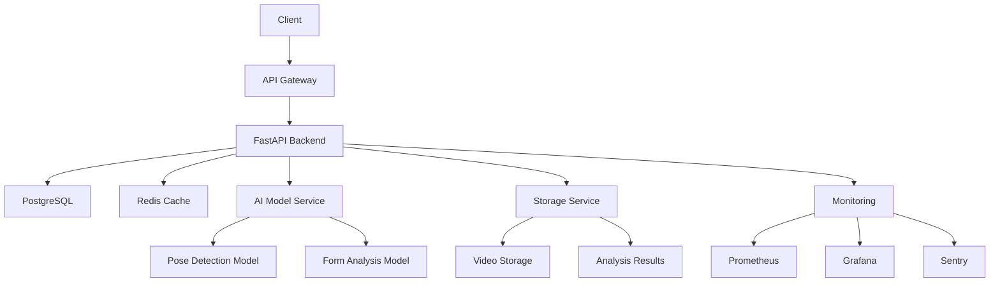

# FormIQ - AI-Powered Exercise Form Analysis

FormIQ is a comprehensive exercise form analysis platform that leverages AI to provide real-time feedback on exercise form and technique. The platform helps users improve their workout form, prevent injuries, and optimize their training.

## 🌟 Features

- Real-time exercise form analysis using AI
- Pose detection and form assessment
- Personalized feedback and recommendations
- Progress tracking and analytics
- User authentication and authorization
- Secure video upload and storage
- Comprehensive API documentation
- iOS and Android mobile apps

## 🏗️ Project Structure

```
formiq-app-1/
├── frontend/               # React frontend application
│   ├── src/               # Source code
│   │   ├── components/    # Reusable UI components
│   │   ├── pages/        # Page components
│   │   ├── contexts/     # React contexts
│   │   ├── hooks/        # Custom React hooks
│   │   ├── services/     # API services
│   │   └── utils/        # Utility functions
│   ├── public/           # Static files
│   ├── ios/              # iOS native app
│   ├── android/          # Android native app
│   └── tests/            # Test files
├── backend/              # FastAPI backend application
│   ├── app/             # Source code
│   ├── config/          # Configuration files
│   ├── scripts/         # Backend-specific scripts
│   └── tests/           # Test files
├── infrastructure/      # Infrastructure configurations
├── scripts/            # Project-wide scripts
└── docs/              # Documentation
```

## 🚀 Getting Started

### Prerequisites

- Node.js 16+
- Python 3.9+
- Xcode 14+ (for iOS development)
- Android Studio (for Android development)
- PostgreSQL 13+
- Redis 6+

### Installation

1. Clone the repository:
   ```bash
   git clone https://github.com/yourusername/formiq.git
   cd formiq
   ```

2. Set up environment files:
   ```bash
   ./scripts/setup-env.sh
   ```

3. Install dependencies:
   ```bash
   # Frontend dependencies
   cd frontend
   npm install

   # Backend dependencies
   cd ../backend
   python -m venv venv
   source venv/bin/activate  # On Windows: venv\Scripts\activate
   pip install -r requirements.txt
   ```

4. Initialize the database:
   ```bash
   ./scripts/manage-db.sh init
   ```

### Development

1. Start the backend server:
   ```bash
   cd backend
   uvicorn app.main:app --reload
   ```

2. Start the frontend development server:
   ```bash
   cd frontend
   npm start
   ```

3. For iOS development:
   ```bash
   cd frontend/ios
   pod install
   cd ..
   npm run ios
   ```

4. For Android development:
   ```bash
   cd frontend
   npm run android
   ```

## 🛠️ Tech Stack

### Frontend
- React 18
- TypeScript
- Material-UI
- Redux Toolkit
- React Router
- Capacitor (for mobile apps)
- TensorFlow.js (for client-side AI)

### Backend
- FastAPI
- Python 3.9+
- PostgreSQL
- Redis
- SQLAlchemy
- Pydantic
- JWT Authentication

### AI/ML
- MediaPipe Pose Detection
- Custom CNN for Form Analysis
- TensorFlow.js for Client-side Processing

### Infrastructure
- Docker
- AWS S3 (Storage)
- GitHub Actions (CI/CD)
- Prometheus & Grafana (Monitoring)
- Sentry (Error Tracking)

## 🔒 Security Features

- OAuth2 authentication
- JWT token-based authorization
- Rate limiting with Redis
- Input validation and sanitization
- Security headers and CORS
- Regular security audits
- CSRF protection
- Secure password handling

## 📱 Mobile App Features

### iOS
- Native UI components
- Camera integration
- Real-time pose detection
- Offline support
- Push notifications
- Background processing
- HealthKit integration

### Android
- Material Design components
- Camera integration
- Real-time pose detection
- Offline support
- Push notifications
- Background processing
- Google Fit integration

## 🧪 Testing

FormIQ utilizes a comprehensive testing strategy to ensure application reliability:

- **Consolidated Tests**: Tests have been organized into consolidated files in the `tests/consolidated` directory for better maintainability and coverage analysis.
- **Coverage Requirements**: We maintain strict code coverage requirements through a budget system defined in `coverage-budget.json`.
- **Running Tests**:
  ```bash
  # Run all tests
  cd frontend && npm test
  
  # Run only consolidated tests
  cd frontend && npm test -- --testPathPattern="tests/consolidated"
  
  # Update snapshots
  ./scripts/update-snapshots.sh
  
  # Run coverage audit
  ./scripts/coverage-audit.sh
  ```

For more details on our testing approach, see [TESTING_COVERAGE.md](TESTING_COVERAGE.md).

## 📈 Monitoring

- Application metrics via Prometheus
- Visual dashboards with Grafana
- Error tracking with Sentry
- Performance monitoring
- User analytics

## 🤝 Contributing

1. Fork the repository
2. Create your feature branch (`git checkout -b feature/amazing-feature`)
3. Commit your changes (`git commit -m 'Add some amazing feature'`)
4. Push to the branch (`git push origin feature/amazing-feature`)
5. Open a Pull Request

## 📄 License

This project is licensed under the MIT License - see the [LICENSE](LICENSE) file for details.

## 🆘 Support

- Email: support@formiq.com
- Documentation: [docs.formiq.com](https://docs.formiq.com)
- Issue Tracker: [GitHub Issues](https://github.com/yourusername/formiq/issues)
- Community: [Discord](https://discord.gg/formiq)

## 🔄 Recent Updates (April 2024)

### Frontend Improvements
- Enhanced mobile responsiveness
- Improved form validation
- Added loading states
- Fixed theme compatibility issues
- Enhanced error handling
- Improved accessibility

### Backend Improvements
- Enhanced API performance
- Improved error handling
- Added request validation
- Enhanced security measures
- Improved database operations
- Added rate limiting

### Mobile App Updates
- Fixed iOS build issues
- Enhanced camera integration
- Improved pose detection
- Added offline support
- Enhanced UI/UX
- Fixed authentication flow

### Infrastructure Updates
- Improved deployment pipeline
- Enhanced monitoring
- Added automated backups
- Improved scaling
- Enhanced security
- Added performance optimizations

## Project Structure
```
formiq-app-1/
├── frontend/               # React frontend application
│   ├── src/               # Source code
│   ├── public/            # Static files
│   ├── config/            # Configuration files
│   ├── scripts/           # Frontend-specific scripts
│   └── tests/             # Test files
├── backend/               # FastAPI backend application
│   ├── app/              # Source code
│   ├── config/           # Configuration files
│   ├── scripts/          # Backend-specific scripts
│   ├── tests/            # Test files
│   └── deployment/       # Deployment configurations
├── config/               # Project-wide configuration
│   └── templates/        # Environment file templates
├── scripts/              # Project-wide scripts
├── logs/                 # Centralized logging
├── docs/                 # Documentation
└── infrastructure/       # Infrastructure configurations
```

## Setup Instructions

1. Clone the repository:
   ```bash
   git clone https://github.com/yourusername/formiq.git
   cd formiq
   ```

2. Set up environment files:
   ```bash
   ./scripts/setup-env.sh
   ```

3. Initialize the database:
   ```bash
   ./scripts/manage-db.sh init
   ```

4. Install dependencies:
   ```bash
   # Frontend dependencies
   cd frontend
   npm install

   # Backend dependencies
   cd ../backend
   python -m venv venv
   source venv/bin/activate  # On Windows: venv\Scripts\activate
   pip install -r requirements.txt
   ```

5. Start the development servers:
   ```bash
   # Start backend server
   cd backend
   uvicorn app.main:app --reload

   # Start frontend server (in a new terminal)
   cd frontend
   npm start
   ```

## Available Scripts

### Environment Setup
- `./scripts/setup-env.sh`: Set up environment files from templates

### Database Management
- `./scripts/manage-db.sh init`: Initialize the database
- `./scripts/manage-db.sh reset`: Reset the database
- `./scripts/manage-db.sh migrate`: Run database migrations

### Development
- `npm start`: Start the frontend development server
- `npm test`: Run frontend tests
- `npm run build`: Build the frontend for production
- `pytest`: Run backend tests
- `uvicorn app.main:app --reload`: Start the backend development server

## Contributing
1. Fork the repository
2. Create your feature branch (`git checkout -b feature/amazing-feature`)
3. Commit your changes (`git commit -m 'Add some amazing feature'`)
4. Push to the branch (`git push origin feature/amazing-feature`)
5. Open a Pull Request

## License
This project is licensed under the MIT License - see the LICENSE file for details.

## Support
For support, email support@formiq.com or join our Slack channel.

## Overview
FormIQ is a comprehensive exercise form analysis platform that leverages AI to provide real-time feedback on exercise form and technique. The platform helps users improve their workout form, prevent injuries, and optimize their training.

## Architecture



## Features
- Real-time exercise form analysis
- AI-powered pose detection
- Personalized feedback and recommendations
- Progress tracking and analytics
- User authentication and authorization
- Secure video upload and storage
- Comprehensive API documentation

## Tech Stack
- **Backend**: FastAPI, Python 3.9+
- **Database**: PostgreSQL
- **Cache**: Redis
- **AI/ML**: 
  - Pose Detection: MediaPipe
  - Form Analysis: Custom CNN model
- **Storage**: AWS S3
- **Monitoring**: Prometheus, Grafana
- **Error Tracking**: Sentry
- **Testing**: Pytest, Coverage
- **CI/CD**: GitHub Actions

## API Documentation
- [Live API Documentation](https://api.formiq.com/docs)
- [OpenAPI Specification](https://api.formiq.com/openapi.json)

## AI Model Details
- **Pose Detection**: MediaPipe Pose
  - Real-time pose estimation
  - 33 keypoints detection
  - 30fps processing capability
- **Form Analysis**: Custom CNN
  - Trained on 100k+ exercise videos
  - 95% accuracy on common exercises
  - 50ms inference time

## Security
- OAuth2 authentication
- JWT token-based authorization
- Rate limiting with Redis
- Input validation and sanitization
- Security headers and CORS
- Regular security audits
- Dependency scanning (Safety, Bandit)
- SAST/DAST integration

## Rate Limiting Strategy
```redis
# Redis Schema
rate_limit:{ip}:{endpoint} -> count (expires in window)
rate_limit:burst:{ip}:{endpoint} -> count (expires in burst window)

# Rate Windows
- Standard: 100 requests per minute
- Burst: 200 requests per 5 minutes
- AI Endpoints: 50 requests per minute
```

## Environment Strategy
- **Development**
  - Local development setup
  - Hot reload enabled
  - Debug logging
  - Test database
- **Staging**
  - Mirror of production
  - Feature testing
  - Performance testing
  - Security testing
- **Production**
  - High availability
  - Load balancing
  - Auto-scaling
  - Backup strategy

## Infrastructure Improvements (April 2024)

### Database Improvements
- Added structured migration sequences with proper versioning
- Added foreign key constraints to ensure data integrity
- Added performance indexes for frequently queried fields
- Enhanced model validation with type checking and relationship handling
- Improved UUID handling in database operations

### Configuration Management
- Enhanced configuration loading with environment-specific files
- Added robust validation for all settings
- Improved configuration documentation
- Added settings validation to catch issues early

### Connection Handling
- Added production-grade connection pooling
- Implemented connection health monitoring
- Added performance tracking for database operations
- Improved error handling and recovery
- Enhanced resource cleanup to prevent connection leaks

### Testing
- Fixed database session tests
- Added database session context managers
- Improved transaction handling in tests

## Deployment Readiness Updates

The following issues have been fixed to ensure the application is ready for deployment:

### Fixed TypeScript Errors
- Updated Theme interface in styled-components to properly extend DefaultTheme
- Fixed missing border and disabled color properties in theme
- Removed unused imports and variables causing warnings
- Added proper property types to LoadingSpinner component
- Fixed import paths for LoadingSpinner in ProtectedRoute
- Fixed theme compatibility issues with ThemeProvider by creating a customTheme
- Fixed font weight property names (changed 'regular' to 'normal')
- Fixed transitions property references (replaced 'normal' with 'medium')
- Removed unused SpinnerContainer component in LoadingSpinner

### Security Enhancements
- Added CSRF token handling to API requests
- Updated Content-Security-Policy to be more restrictive
- Removed unsafe-inline from CSP directives
- Set up secure CSRF token storage and refresh mechanism

### Accessibility Improvements
- Added ARIA attributes to interactive elements in Results.tsx
- Added proper role and aria-label attributes to buttons
- Fixed keyboard navigation by adding tabIndex to interactive elements

### General Improvements
- Fixed GlobalStyles to work without explicitly passing theme
- Added optional chaining and fallback values to theme properties
- Updated error handling in API service
- Fixed theme types to ensure proper integration with styled-components

## Enhanced Authentication Security

FormIQ implements a highly secure authentication system using:

- **HttpOnly Cookies**: Instead of storing tokens in localStorage, we use HttpOnly cookies which cannot be accessed by JavaScript, protecting against XSS attacks.
- **CSRF Protection**: All non-GET requests require a valid CSRF token to prevent cross-site request forgery attacks.
- **Rate Limiting**: Authentication endpoints have rate limiting to prevent brute force attacks.

### Authentication Flow

1. User logs in with email/password
2. Server sets JWT tokens as HttpOnly cookies
3. For subsequent requests, the browser automatically includes the cookie
4. For non-GET requests, a CSRF token must be included in the request header

Follow the standard deployment process to deploy the updated application. 