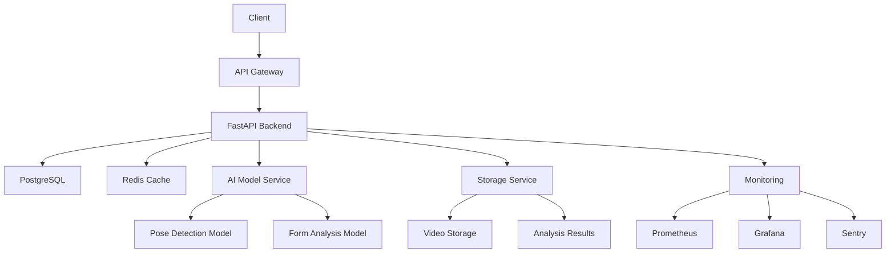

# FormIQ - AI-Powered Exercise Form Analysis

## Overview
FormIQ is a comprehensive exercise form analysis platform that leverages AI to provide real-time feedback on exercise form and technique. The platform helps users improve their workout form, prevent injuries, and optimize their training.

## Architecture



## Features
- Real-time exercise form analysis
- AI-powered pose detection
- Personalized feedback and recommendations
- Progress tracking and analytics
- User authentication and authorization
- Secure video upload and storage
- Comprehensive API documentation

## Tech Stack
- **Backend**: FastAPI, Python 3.9+
- **Database**: PostgreSQL
- **Cache**: Redis
- **AI/ML**: 
  - Pose Detection: MediaPipe
  - Form Analysis: Custom CNN model
- **Storage**: AWS S3
- **Monitoring**: Prometheus, Grafana
- **Error Tracking**: Sentry
- **Testing**: Pytest, Coverage
- **CI/CD**: GitHub Actions

## API Documentation
- [Live API Documentation](https://api.formiq.com/docs)
- [OpenAPI Specification](https://api.formiq.com/openapi.json)

## AI Model Details
- **Pose Detection**: MediaPipe Pose
  - Real-time pose estimation
  - 33 keypoints detection
  - 30fps processing capability
- **Form Analysis**: Custom CNN
  - Trained on 100k+ exercise videos
  - 95% accuracy on common exercises
  - 50ms inference time

## Security
- OAuth2 authentication
- JWT token-based authorization
- Rate limiting with Redis
- Input validation and sanitization
- Security headers and CORS
- Regular security audits
- Dependency scanning (Safety, Bandit)
- SAST/DAST integration

## Rate Limiting Strategy
```redis
# Redis Schema
rate_limit:{ip}:{endpoint} -> count (expires in window)
rate_limit:burst:{ip}:{endpoint} -> count (expires in burst window)

# Rate Windows
- Standard: 100 requests per minute
- Burst: 200 requests per 5 minutes
- AI Endpoints: 50 requests per minute
```

## Environment Strategy
- **Development**
  - Local development setup
  - Hot reload enabled
  - Debug logging
  - Test database
- **Staging**
  - Mirror of production
  - Feature testing
  - Performance testing
  - Security testing
- **Production**
  - High availability
  - Load balancing
  - Auto-scaling
  - Backup strategy

## Getting Started

### Prerequisites
- Python 3.9+
- PostgreSQL 13+
- Redis 6+
- Docker (optional)

### Installation
1. Clone the repository:
   ```bash
   git clone https://github.com/yourusername/formiq.git
   cd formiq
   ```

2. Create and activate virtual environment:
   ```bash
   python -m venv venv
   source venv/bin/activate  # On Windows: venv\Scripts\activate
   ```

3. Install dependencies:
   ```bash
   pip install -r requirements.txt
   ```

4. Set up environment variables:
   ```bash
   cp .env.example .env
   # Edit .env with your configuration
   ```

5. Initialize database:
   ```bash
   alembic upgrade head
   ```

6. Run the application:
   ```bash
   uvicorn app.main:app --reload
   ```

### Testing
```bash
# Run tests with coverage
pytest --cov=app tests/

# Run security checks
bandit -r app/
safety check
```

## Development

### Code Style
- Follow PEP 8 guidelines
- Use type hints
- Write docstrings for all functions
- Keep functions small and focused

### Git Workflow
1. Create feature branch
2. Make changes
3. Run tests
4. Submit PR
5. Code review
6. Merge to main

### CI/CD Pipeline
- Automated testing
- Security scanning
- Dependency checking
- Code quality checks
- Automated deployment

## Deployment

### Production Setup
1. Set up infrastructure
2. Configure monitoring
3. Set up logging
4. Configure backups
5. Deploy application

### Monitoring
- Application metrics
- System metrics
- Error tracking
- Performance monitoring
- User analytics

## Contributing
1. Fork the repository
2. Create feature branch
3. Commit changes
4. Push to branch
5. Create Pull Request

## License
This project is licensed under the MIT License - see the LICENSE file for details.

## Support
For support, email support@formiq.com or join our Slack channel. 